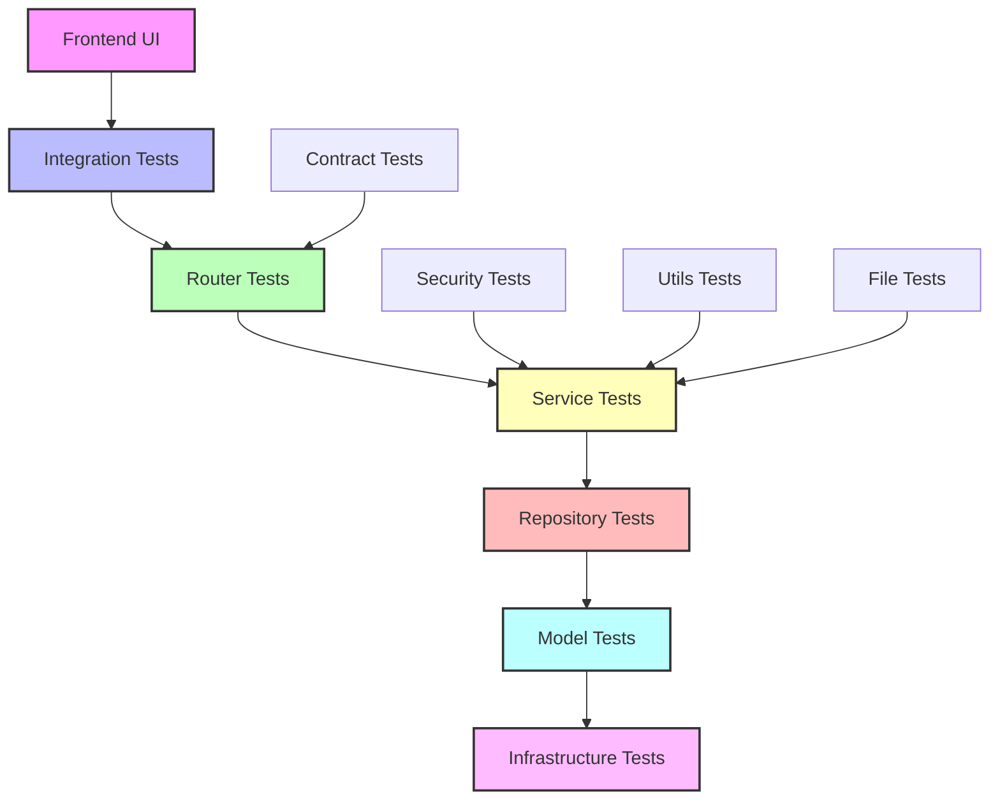

# 테스트 사용법 및 회귀 테스트 가이드

## 📋 목차

1. [테스트 모듈 관계 시각화](#테스트-모듈-관계-시각화)
2. [회귀 테스트 체계](#회귀-테스트-체계)
3. [테스트 실행 시나리오](#테스트-실행-시나리오)
4. [Mock 사용법 상세 가이드](#mock-사용법-상세-가이드)
5. [CI/CD 통합 가이드](#cicd-통합-가이드)
6. [트러블슈팅 가이드](#트러블슈팅-가이드)

---

## 🗺️ 테스트 모듈 관계 시각화

### 전체 아키텍처 다이어그램

```
┌─────────────────────────────────────────────────────────────────┐
│                    📱 Frontend Layer                           │
│                 (Manual Testing)                               │
└─────────────────────────────────────────────────────────────────┘
                              │ HTTP/API
┌─────────────────────────────────────────────────────────────────┐
│                🔗 Integration Tests                             │
│ ┌─────────────┐ ┌─────────────┐ ┌─────────────┐ ┌─────────────┐ │
│ │auth_router  │ │posts_router │ │comments_    │ │file_upload  │ │
│ │    .py      │ │    .py      │ │router.py    │ │   _api.py   │ │
│ └─────────────┘ └─────────────┘ └─────────────┘ └─────────────┘ │
└─────────────────────────────────────────────────────────────────┘
                              │ API Calls
┌─────────────────────────────────────────────────────────────────┐
│                  🏢 Service Layer Tests                        │
│ ┌─────────────┐ ┌─────────────┐ ┌─────────────┐ ┌─────────────┐ │
│ │auth_service │ │posts_service│ │comments_    │ │content_     │ │
│ │    .py      │ │    .py      │ │service.py   │ │service.py   │ │
│ └─────────────┘ └─────────────┘ └─────────────┘ └─────────────┘ │
└─────────────────────────────────────────────────────────────────┘
                              │ Business Logic
┌─────────────────────────────────────────────────────────────────┐
│                💾 Repository Layer Tests                       │
│ ┌─────────────┐ ┌─────────────┐ ┌─────────────┐ ┌─────────────┐ │
│ │user_        │ │post_        │ │comment_     │ │file_        │ │
│ │repository.py│ │repository.py│ │repository.py│ │repository.py│ │
│ └─────────────┘ └─────────────┘ └─────────────┘ └─────────────┘ │
└─────────────────────────────────────────────────────────────────┘
                              │ Data Access
┌─────────────────────────────────────────────────────────────────┐
│                📊 Model & Utils Tests                          │
│ ┌──────────┐ ┌──────────┐ ┌──────────┐ ┌──────────┐ ┌──────────┐ │
│ │models    │ │jwt.py    │ │password  │ │permissions│ │file_     │ │
│ │tests     │ │          │ │.py       │ │.py        │ │utils     │ │
│ └──────────┘ └──────────┘ └──────────┘ └──────────┘ └──────────┘ │
└─────────────────────────────────────────────────────────────────┘
                              │ Core Functions
┌─────────────────────────────────────────────────────────────────┐
│                🏗️ Infrastructure Tests                         │
│ ┌─────────────┐ ┌─────────────┐ ┌─────────────┐ ┌─────────────┐ │
│ │database_    │ │config_      │ │indexes_     │ │dependency   │ │
│ │connection.py│ │settings.py  │ │creation.py  │ │tests        │ │
│ └─────────────┘ └─────────────┘ └─────────────┘ └─────────────┘ │
└─────────────────────────────────────────────────────────────────┘
```

### 의존성 흐름도



### 테스트 실행 순서 및 의존성

#### 1단계: 기반 인프라 테스트 🏗️
```bash
# 데이터베이스 연결 및 설정
uv run pytest tests/unit/test_database_connection.py
uv run pytest tests/unit/test_config_settings.py
uv run pytest tests/unit/test_indexes_creation.py
```

#### 2단계: 모델 및 유틸리티 테스트 📊
```bash
# 데이터 모델 검증
uv run pytest tests/unit/test_*_model.py
uv run pytest tests/unit/test_models_validation.py

# 유틸리티 함수 검증
uv run pytest tests/unit/test_jwt.py
uv run pytest tests/unit/test_password.py
uv run pytest tests/unit/test_permissions.py
```

#### 3단계: Repository 계층 테스트 💾
```bash
# 데이터 액세스 레이어
uv run pytest tests/unit/test_*_repository.py -v
```

#### 4단계: Service 계층 테스트 🏢
```bash
# 비즈니스 로직 레이어
uv run pytest tests/unit/test_*_service.py -v
```

#### 5단계: 통합 테스트 🔗
```bash
# API 엔드포인트 통합
uv run pytest tests/integration/ -v
```

#### 6단계: 특수 테스트 🔒📄
```bash
# 계약 및 보안 테스트
uv run pytest tests/contract/ -v
uv run pytest tests/security/ -v
```

---

## 🔄 회귀 테스트 체계

### 테스트 피라미드 전략

#### ⚡ 빠른 피드백 (< 30초)
```bash
# 핵심 비즈니스 로직만
uv run pytest tests/unit/test_auth_service.py::test_login_success \
              tests/unit/test_posts_service.py::test_create_post_success \
              tests/unit/test_comments_service.py::test_create_comment_success \
              -v --tb=short
```

#### 🔧 개발자 피드백 (< 5분)
```bash
# Service + Utils 계층 전체
uv run pytest tests/unit/test_*_service.py \
              tests/unit/test_jwt.py \
              tests/unit/test_password.py \
              tests/unit/test_permissions.py \
              -v --maxfail=3
```

#### 🔗 통합 검증 (< 15분)
```bash
# Unit + Integration 테스트
uv run pytest tests/unit/ tests/integration/ \
              -v --maxfail=5 --tb=short
```

#### 🎯 전체 검증 (< 30분)
```bash
# 모든 테스트 실행
uv run pytest tests/ -v --cov=src --cov-report=html
```

### 회귀 테스트 시나리오

#### 📅 일일 회귀 테스트 (CI Pipeline)
```yaml
# .github/workflows/daily-regression.yml
name: Daily Regression Tests
on:
  schedule:
    - cron: '0 9 * * *'  # 매일 오전 9시
  push:
    branches: [main, develop]

jobs:
  regression:
    runs-on: ubuntu-latest
    steps:
      - uses: actions/checkout@v3
      - name: Setup Python
        uses: actions/setup-python@v4
        with:
          python-version: '3.11'
      
      - name: Install dependencies
        run: |
          pip install uv
          uv sync
      
      - name: Core Business Logic Tests
        run: |
          uv run pytest tests/unit/test_*_service.py \
                        tests/unit/test_jwt.py \
                        tests/unit/test_password.py \
                        -v --maxfail=1
      
      - name: Integration Tests
        run: |
          uv run pytest tests/integration/ -v --maxfail=1
      
      - name: Security Tests
        run: |
          uv run pytest tests/security/ -v
```

#### 🚀 배포 전 회귀 테스트
```bash
#!/bin/bash
# scripts/pre-deployment-tests.sh

echo "🚀 배포 전 전체 회귀 테스트 시작..."

# 1. 환경 검증
echo "📋 환경 변수 검증..."
uv run pytest tests/unit/test_config_settings.py -v

# 2. 데이터베이스 연결 검증
echo "🗄️ 데이터베이스 연결 검증..."
uv run pytest tests/unit/test_database_connection.py -v

# 3. 핵심 기능 테스트
echo "🔧 핵심 기능 테스트..."
uv run pytest tests/unit/test_*_service.py -v --maxfail=1

# 4. API 통합 테스트
echo "🔗 API 통합 테스트..."
uv run pytest tests/integration/ -v --maxfail=1

# 5. 계약 및 보안 테스트
echo "🔒 보안 및 계약 테스트..."
uv run pytest tests/contract/ tests/security/ -v

# 6. 커버리지 확인
echo "📊 커버리지 측정..."
uv run pytest tests/ --cov=src --cov-report=term --cov-fail-under=85

echo "✅ 모든 회귀 테스트 완료!"
```

### 테스트 실패 시 대응 절차

#### 🚨 Critical Path 실패 (인증, 핵심 API)
```bash
# 즉시 중단 및 롤백 필요
echo "🚨 Critical path 실패 감지"
echo "📋 실패한 테스트: $FAILED_TEST"
echo "🔄 자동 롤백 시작..."

# 실패 로그 수집
uv run pytest $FAILED_TEST -v --tb=long > failure_log.txt

# 알림 발송 (Slack, Email 등)
curl -X POST -H 'Content-type: application/json' \
     --data '{"text":"🚨 Critical test failure: '$FAILED_TEST'"}' \
     $SLACK_WEBHOOK_URL
```

#### ⚠️ Non-Critical 실패 (선택적 기능)
```bash
# 로그 기록 및 이슈 생성
echo "⚠️ Non-critical 테스트 실패"
echo "📝 이슈 티켓 생성..."

# GitHub Issue 자동 생성
gh issue create --title "Test Failure: $FAILED_TEST" \
                --body "자동 생성된 테스트 실패 리포트" \
                --label "bug,testing"
```

---

## 🎯 테스트 실행 시나리오

### 개발 워크플로우별 테스트

#### 🔨 새 기능 개발 시
```bash
# 1. TDD 사이클: Red → Green → Refactor
echo "🔴 실패하는 테스트 작성..."
uv run pytest tests/unit/test_new_feature.py::test_new_functionality -v
# 예상: FAILED

echo "🟢 최소 구현으로 테스트 통과..."
# 기능 구현 후
uv run pytest tests/unit/test_new_feature.py::test_new_functionality -v
# 예상: PASSED

echo "🔄 리팩터링 후 전체 테스트..."
uv run pytest tests/unit/test_new_feature.py -v
# 모든 테스트 통과 확인
```

#### 🐛 버그 수정 시
```bash
# 1. 버그 재현 테스트 작성
echo "🐛 버그 재현 테스트 작성..."
uv run pytest tests/unit/test_bug_reproduction.py -v
# 예상: FAILED (버그 재현)

# 2. 버그 수정 후 테스트
echo "🔧 버그 수정 후 검증..."
uv run pytest tests/unit/test_bug_reproduction.py -v
# 예상: PASSED

# 3. 관련 기능 회귀 테스트
echo "🔄 관련 기능 회귀 테스트..."
uv run pytest tests/unit/test_related_functionality.py -v
```

#### 🔄 리팩터링 시
```bash
# 1. 리팩터링 전 전체 테스트
echo "📋 리팩터링 전 베이스라인 설정..."
uv run pytest tests/unit/test_target_module.py -v > baseline.log

# 2. 리팩터링 수행 후 동일 테스트
echo "🔄 리팩터링 후 동작 확인..."
uv run pytest tests/unit/test_target_module.py -v > after_refactor.log

# 3. 결과 비교
echo "📊 테스트 결과 비교..."
diff baseline.log after_refactor.log
```

### 환경별 테스트 실행

#### 🏠 로컬 개발 환경
```bash
# 빠른 피드백을 위한 필수 테스트만
export TEST_ENV=local
uv run pytest tests/unit/test_*_service.py -v --tb=short -x
```

#### 🧪 테스트 환경
```bash
# 전체 테스트 스위트 실행
export TEST_ENV=testing
export DATABASE_URL=mongodb://test-db:27017/test_db
uv run pytest tests/ -v --cov=src --maxfail=10
```

#### 🚀 스테이징 환경
```bash
# 프로덕션과 유사한 환경에서 테스트
export TEST_ENV=staging
export DATABASE_URL=$STAGING_DATABASE_URL
uv run pytest tests/integration/ tests/contract/ -v --maxfail=1
```

---

## 🎭 Mock 사용법 상세 가이드

### Mock 사용 결정 트리

```
테스트하려는 컴포넌트가...
│
├─ 이미 구현 완료됨?
│  ├─ YES → Mock 사용 금지 ❌
│  │         실제 구현 테스트 권장 ✅
│  │
│  └─ NO → 구현 우선, 이후 Mock 검토
│
├─ 외부 의존성 (DB, API, 파일)?
│  ├─ YES → Mock 사용 권장 🎭
│  │         이유: 호출 비용 높음
│  │
│  └─ NO → 실제 구현 테스트 ✅
│
└─ 순수 함수 (Utils, 계산)?
   └─ Mock 사용 금지 ❌
      실제 함수 호출 권장 ✅
```

### Mock 사용 패턴 및 예시

#### ✅ 적절한 Mock 사용 - Repository 계층
```python
# tests/unit/test_posts_service_enhanced.py

@pytest.fixture
def mock_post_repository():
    """
    🚨 Mock 사용 이유: PostRepository (DB 호출 비용 높음)
    🔄 대안 검토: 실제 DB 사용 시 테스트 불안정성, 느린 실행
    📋 검증 범위: PostsService 비즈니스 로직만 테스트
    """
    repo = Mock(spec=PostRepository)
    return repo

@pytest.fixture  
def posts_service(mock_post_repository):
    """
    ✅ 실제 구현 사용: PostsService 비즈니스 로직 직접 테스트
    """
    return PostsService(post_repository=mock_post_repository)

async def test_create_post_success(posts_service, mock_post_repository):
    """실제 PostsService + Repository Mock 조합"""
    # Arrange
    mock_post_repository.create.return_value = expected_post
    
    # Act - 실제 Service 메서드 호출
    result = await posts_service.create_post(post_data, user)
    
    # Assert - 실제 비즈니스 로직 검증
    assert result == expected_post
    mock_post_repository.create.assert_called_once()
```

#### ❌ 부적절한 Mock 사용 - Service 계층
```python
# ❌ 잘못된 예시
@pytest.fixture
def mock_posts_service():
    """❌ 이미 구현된 PostsService를 Mock으로 대체"""
    return Mock(spec=PostsService)

def test_create_post_wrong(mock_posts_service):
    """❌ Mock이 실제 비즈니스 로직을 숨김"""
    mock_posts_service.create_post.return_value = "fake_result"
    # 실제 비즈니스 로직이 테스트되지 않음!
```

#### ✅ 올바른 수정 - 실제 구현 테스트
```python
# ✅ 올바른 예시
@pytest.fixture
def posts_service(mock_post_repository):
    """✅ 실제 PostsService 인스턴스 사용"""
    return PostsService(post_repository=mock_post_repository)

async def test_create_post_correct(posts_service, mock_post_repository):
    """✅ 실제 비즈니스 로직 테스트"""
    # 실제 Service 메서드가 올바른 로직으로 동작하는지 검증
    result = await posts_service.create_post(post_data, user)
    # 실제 구현된 검증 로직, 변환 로직 등이 모두 테스트됨
```

### Mock 설정 베스트 프랙티스

#### Repository Mock 설정
```python
@pytest.fixture
def configured_mock_repository():
    """완전히 설정된 Repository Mock"""
    repo = Mock(spec=PostRepository)
    
    # 일반적인 성공 시나리오 설정
    repo.create.return_value = create_sample_post()
    repo.get_by_id.return_value = create_sample_post()
    repo.list_posts.return_value = ([], 0)
    
    # 예외 시나리오도 미리 설정
    repo.get_by_id.side_effect = lambda id: (
        create_sample_post() if id == "valid_id" 
        else PostNotFoundError(f"Post {id} not found")
    )
    
    return repo
```

#### 외부 API Mock 설정
```python
@patch('requests.post')
def test_external_api_integration(mock_post):
    """
    🚨 Mock 사용 이유: 외부 API 호출 (네트워크 의존성)
    🔄 대안 검토: 실제 API 호출 시 네트워크 지연, 외부 서비스 장애 영향
    """
    # 성공 응답 설정
    mock_post.return_value.status_code = 200
    mock_post.return_value.json.return_value = {"success": True}
    
    # 실제 서비스 로직 테스트
    result = external_service.send_notification(data)
    
    # API 호출 검증
    mock_post.assert_called_once_with(
        url="https://api.example.com/notify",
        json=expected_payload
    )
```

---

## 🚀 CI/CD 통합 가이드

### GitHub Actions 워크플로우

#### 기본 CI 파이프라인
```yaml
# .github/workflows/ci.yml
name: Continuous Integration

on:
  push:
    branches: [main, develop]
  pull_request:
    branches: [main]

jobs:
  test:
    runs-on: ubuntu-latest
    strategy:
      matrix:
        python-version: [3.11]
    
    services:
      mongodb:
        image: mongo:6.0
        ports:
          - 27017:27017
    
    steps:
      - uses: actions/checkout@v3
      
      - name: Set up Python ${{ matrix.python-version }}
        uses: actions/setup-python@v4
        with:
          python-version: ${{ matrix.python-version }}
      
      - name: Install uv
        run: pip install uv
      
      - name: Install dependencies
        run: uv sync
      
      - name: Run infrastructure tests
        run: |
          uv run pytest tests/unit/test_database_connection.py \
                        tests/unit/test_config_settings.py \
                        -v --maxfail=1
      
      - name: Run unit tests
        run: |
          uv run pytest tests/unit/ -v --cov=src --cov-report=xml
      
      - name: Run integration tests
        run: |
          uv run pytest tests/integration/ -v
        env:
          DATABASE_URL: mongodb://localhost:27017/test_db
      
      - name: Upload coverage to Codecov
        uses: codecov/codecov-action@v3
        with:
          file: ./coverage.xml
          flags: unittests
          name: codecov-umbrella
          fail_ci_if_error: true
```

#### 배포 파이프라인
```yaml
# .github/workflows/deploy.yml
name: Deploy to Production

on:
  release:
    types: [published]

jobs:
  test-and-deploy:
    runs-on: ubuntu-latest
    
    steps:
      - uses: actions/checkout@v3
      
      - name: Setup Python
        uses: actions/setup-python@v4
        with:
          python-version: '3.11'
      
      - name: Install dependencies
        run: |
          pip install uv
          uv sync
      
      - name: Pre-deployment regression tests
        run: |
          # 전체 테스트 스위트 실행
          uv run pytest tests/ -v --cov=src --cov-fail-under=85
          
          # 보안 테스트 필수 실행
          uv run pytest tests/security/ -v --maxfail=1
          
          # 계약 테스트 확인
          uv run pytest tests/contract/ -v --maxfail=1
        env:
          DATABASE_URL: ${{ secrets.TEST_DATABASE_URL }}
      
      - name: Deploy to production
        if: success()
        run: |
          echo "🚀 배포 시작..."
          # 실제 배포 스크립트 실행
          ./scripts/deploy.sh
        env:
          PRODUCTION_DATABASE_URL: ${{ secrets.PRODUCTION_DATABASE_URL }}
          SECRET_KEY: ${{ secrets.SECRET_KEY }}
      
      - name: Post-deployment verification
        run: |
          # 배포 후 헬스 체크
          uv run pytest tests/integration/test_health_check.py -v
```

### 테스트 결과 알림 설정

#### Slack 통합
```yaml
      - name: Notify test results
        if: always()
        uses: 8398a7/action-slack@v3
        with:
          status: ${{ job.status }}
          channel: '#dev-team'
          text: |
            🧪 테스트 결과: ${{ job.status }}
            📦 Branch: ${{ github.ref }}
            👤 Author: ${{ github.actor }}
            🔗 Details: ${{ github.server_url }}/${{ github.repository }}/actions/runs/${{ github.run_id }}
        env:
          SLACK_WEBHOOK_URL: ${{ secrets.SLACK_WEBHOOK_URL }}
```

---

## 🛠️ 트러블슈팅 가이드

### 일반적인 테스트 실패 패턴

#### ❌ Mock 관련 오류
```python
# 문제: Mock 속성 접근 오류
AttributeError: Mock object has no attribute 'some_method'

# 해결방법 1: spec 파라미터 사용
mock_service = Mock(spec=ServiceClass)

# 해결방법 2: 명시적 속성 설정
mock_service.some_method = Mock(return_value="expected_value")

# 해결방법 3: 실제 구현 사용 (권장)
real_service = ServiceClass(mock_dependency=mock_repo)
```

#### ❌ 비동기 테스트 오류
```python
# 문제: RuntimeError: This event loop is already running
RuntimeError: This event loop is already running

# 해결방법: pytest-asyncio 설정
# pytest.ini
[tool:pytest]
asyncio_mode = auto

# 또는 개별 테스트에 마커 추가
@pytest.mark.asyncio
async def test_async_function():
    result = await async_function()
    assert result is not None
```

#### ❌ 데이터베이스 연결 오류
```python
# 문제: ConnectionError: Cannot connect to MongoDB
pymongo.errors.ServerSelectionTimeoutError

# 해결방법 1: 환경 변수 확인
export DATABASE_URL="mongodb://localhost:27017/test_db"

# 해결방법 2: Docker 컨테이너 실행
docker run -d -p 27017:27017 --name test-mongo mongo:6.0

# 해결방법 3: 테스트용 임베디드 DB 사용
@pytest.fixture
def test_db():
    # mongomock 또는 임베디드 MongoDB 사용
    return create_test_database()
```

### 성능 문제 해결

#### 🐌 느린 테스트 최적화
```bash
# 문제: 테스트 실행 시간이 너무 길음

# 해결방법 1: 병렬 실행
pip install pytest-xdist
uv run pytest tests/unit/ -n auto

# 해결방법 2: 실행 시간 측정
uv run pytest tests/ --durations=10

# 해결방법 3: 느린 테스트 분리
uv run pytest tests/unit/ -m "not slow"
```

#### 📊 메모리 사용량 최적화
```python
# 문제: 메모리 부족으로 테스트 실패

# 해결방법 1: 피처별 실행
uv run pytest tests/unit/test_posts_service.py
uv run pytest tests/unit/test_comments_service.py

# 해결방법 2: 메모리 프로파일링
@pytest.fixture(autouse=True)
def memory_monitor():
    import psutil
    process = psutil.Process()
    memory_before = process.memory_info().rss
    yield
    memory_after = process.memory_info().rss
    memory_diff = memory_after - memory_before
    if memory_diff > 100 * 1024 * 1024:  # 100MB
        print(f"⚠️ High memory usage: {memory_diff / 1024 / 1024:.1f}MB")
```

### 디버깅 도구 및 기법

#### 🔍 테스트 디버깅
```bash
# 상세한 출력으로 실행
uv run pytest tests/unit/test_failing.py -v -s --tb=long

# 특정 테스트만 실행
uv run pytest tests/unit/test_posts_service.py::test_create_post_success -v

# PDB 디버거 사용
uv run pytest tests/unit/test_failing.py --pdb

# 실패 시에만 PDB 실행
uv run pytest tests/unit/test_failing.py --pdb-trace
```

#### 📝 로그 기반 디버깅
```python
# conftest.py
import logging

@pytest.fixture(autouse=True)
def setup_logging():
    """테스트용 로깅 설정"""
    logging.basicConfig(
        level=logging.DEBUG,
        format='%(asctime)s - %(name)s - %(levelname)s - %(message)s'
    )
    
    # 테스트 중 로그 출력
    logger = logging.getLogger("test")
    logger.info("테스트 시작")
    yield
    logger.info("테스트 완료")
```

### 환경별 문제 해결

#### 🏠 로컬 환경 문제
```bash
# Python 버전 불일치
pyenv local 3.11.0
uv sync

# 의존성 문제
uv lock --upgrade
uv sync --refresh

# 캐시 문제
pytest --cache-clear
rm -rf .pytest_cache/
```

#### 🔧 CI/CD 환경 문제
```yaml
# GitHub Actions에서 환경 변수 디버깅
      - name: Debug environment
        run: |
          echo "Python version: $(python --version)"
          echo "Working directory: $(pwd)"
          echo "Environment variables:"
          env | grep -E "^(TEST_|DATABASE_|SECRET_)" | sort
          
      - name: Test with verbose output
        run: |
          uv run pytest tests/ -v --tb=short --maxfail=1
        continue-on-error: true
```

---

## 📊 성능 및 품질 메트릭스

### 테스트 실행 시간 목표
- **Unit Tests**: < 30초 (전체)
- **Integration Tests**: < 2분 (전체)
- **Contract Tests**: < 1분 (전체)
- **Security Tests**: < 30초 (전체)
- **전체 Test Suite**: < 5분 (CI 환경)

### 코드 커버리지 목표
- **Unit Tests**: 90%+ 라인 커버리지
- **Branch Coverage**: 85%+ 분기 커버리지
- **Function Coverage**: 95%+ 함수 커버리지

### 품질 게이트
```bash
# 품질 기준을 통과해야 배포 가능
uv run pytest tests/ --cov=src --cov-fail-under=85
uv run pytest tests/security/ --maxfail=0
uv run pytest tests/contract/ --maxfail=0
```

---

**📝 마지막 업데이트**: 2025년 06월 28일
**🔄 다음 업데이트**: 테스트 도구 또는 프로세스 변경 시