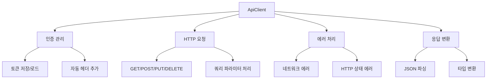
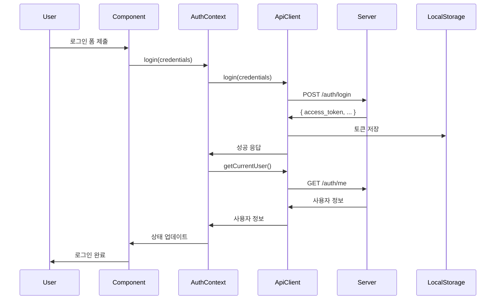
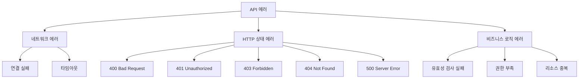

# API 연동 가이드

## 📚 목차
1. [API 클라이언트 구조](#api-클라이언트-구조)
2. [인증 시스템](#인증-시스템)
3. [API 엔드포인트](#api-엔드포인트)
4. [에러 처리](#에러-처리)
5. [상태 관리와 API 연동](#상태-관리와-api-연동)
6. [실사용 예시](#실사용-예시)
7. [테스팅 가이드](#테스팅-가이드)

## 🔧 API 클라이언트 구조

### ApiClient 클래스 개요



### 기본 구조

```typescript
class ApiClient {
  private baseURL: string;
  private token: string | null = null;

  constructor(baseURL: string = API_BASE_URL) {
    this.baseURL = baseURL;
    this.loadToken();
  }

  // 토큰 관리
  private loadToken(): void
  private saveToken(token: string): void
  private removeToken(): void
  
  // HTTP 요청
  private async request<T>(endpoint: string, options?: RequestInit): Promise<ApiResponse<T>>
  
  // 인증 API
  async login(credentials: LoginRequest): Promise<ApiResponse<AuthToken>>
  async register(userData: RegisterRequest): Promise<ApiResponse<User>>
  async getCurrentUser(): Promise<ApiResponse<User>>
  
  // 게시글 API
  async getPosts(filters?: PostFilters): Promise<ApiResponse<PaginatedResponse<Post>>>
  async getPost(slug: string): Promise<ApiResponse<Post>>
  async createPost(postData: CreatePostRequest): Promise<ApiResponse<Post>>
  
  // 댓글 API
  async getComments(postSlug: string, page?: number): Promise<ApiResponse<PaginatedResponse<Comment>>>
  async createComment(postSlug: string, commentData: CreateCommentRequest): Promise<ApiResponse<Comment>>
}
```

### API 응답 타입

```typescript
interface ApiResponse<T = any> {
  success: boolean;
  data?: T;
  message?: string;
  error?: string;
  timestamp: string;
}

interface PaginatedResponse<T> {
  items: T[];
  total: number;
  page: number;
  size: number;
  pages: number;
}
```

## 🔐 인증 시스템

### 인증 플로우



### 토큰 관리

```typescript
class ApiClient {
  private loadToken(): void {
    if (typeof window !== 'undefined') {
      this.token = localStorage.getItem('authToken');
    }
  }

  private saveToken(token: string): void {
    this.token = token;
    if (typeof window !== 'undefined') {
      localStorage.setItem('authToken', token);
    }
  }

  private getHeaders(): Record<string, string> {
    const headers: Record<string, string> = {
      'Content-Type': 'application/json',
    };

    if (this.token) {
      headers['Authorization'] = `Bearer ${this.token}`;
    }

    return headers;
  }
}
```

### AuthContext 구현

```typescript
export const AuthProvider = ({ children }: AuthProviderProps) => {
  const [user, setUser] = useState<User | null>(null);
  const [token, setToken] = useState<string | null>(null);
  const [isLoading, setIsLoading] = useState(true);

  const login = useCallback(async (credentials: LoginRequest) => {
    const response = await apiClient.login(credentials);
    
    if (response.success && response.data) {
      const { access_token } = response.data;
      setToken(access_token);
      
      // 사용자 정보 가져오기
      const userResponse = await apiClient.getCurrentUser();
      if (userResponse.success && userResponse.data) {
        setUser(userResponse.data);
      }
    }
  }, []);

  const logout = useCallback(() => {
    setUser(null);
    setToken(null);
    apiClient.logout();
  }, []);

  return (
    <AuthContext.Provider value={{ user, token, login, logout, isAuthenticated: !!user }}>
      {children}
    </AuthContext.Provider>
  );
};
```

## 🌐 API 엔드포인트

### 인증 API

#### POST /auth/login
```typescript
// 요청
interface LoginRequest {
  email: string;
  password: string;
}

// 응답
interface AuthToken {
  access_token: string;
  token_type: string;
  expires_in?: number;
}

// 사용법
const response = await apiClient.login({
  email: "user@example.com",
  password: "password123"
});
```

#### POST /auth/register
```typescript
// 요청
interface RegisterRequest {
  email: string;
  user_handle: string;
  display_name?: string;
  password: string;
}

// 응답
interface User {
  id: string;
  email: string;
  user_handle?: string;
  display_name?: string;
  created_at: string;
  updated_at: string;
}
```

#### GET /auth/me
```typescript
// 인증된 사용자 정보 조회
const response = await apiClient.getCurrentUser();
```

### 게시글 API

#### GET /posts
```typescript
// 쿼리 파라미터
interface PostFilters {
  type?: PostType;
  service?: ServiceType;
  sortBy?: "created_at" | "views" | "likes";
  search?: string;
  page?: number;
  size?: number;
}

// 사용법
const response = await apiClient.getPosts({
  type: "자유게시판",
  page: 1,
  size: 10
});
```

#### GET /posts/{slug}
```typescript
const response = await apiClient.getPost("my-post-slug");
```

#### POST /posts
```typescript
// 요청 (인증 필요)
interface CreatePostRequest {
  title: string;
  content: string;
  service: ServiceType;
  type?: PostType;
  tags?: string[];
}

const response = await apiClient.createPost({
  title: "새 게시글",
  content: "게시글 내용",
  service: "community",
  type: "자유게시판"
});
```

### 댓글 API

#### GET /posts/{slug}/comments
```typescript
const response = await apiClient.getComments("post-slug", 1);
```

#### POST /posts/{slug}/comments
```typescript
// 요청 (인증 필요)
interface CreateCommentRequest {
  content: string;
  parent_id?: number;
}

const response = await apiClient.createComment("post-slug", {
  content: "댓글 내용"
});
```

### 반응 API

#### POST /reactions
```typescript
const response = await apiClient.toggleReaction(
  postId, 
  "post", 
  "like"
);
```

## ⚠️ 에러 처리

### 에러 타입 분류



### 에러 처리 구현

```typescript
class ApiClient {
  private async request<T>(endpoint: string, options: RequestInit = {}): Promise<ApiResponse<T>> {
    try {
      const response = await fetch(url, config);
      const data = await response.json();

      if (!response.ok) {
        throw new Error(data.message || `HTTP error! status: ${response.status}`);
      }

      return {
        success: true,
        data,
        timestamp: new Date().toISOString(),
      };
    } catch (error) {
      console.error('API request failed:', error);
      return {
        success: false,
        error: error instanceof Error ? error.message : 'Unknown error',
        timestamp: new Date().toISOString(),
      };
    }
  }
}
```

### 컴포넌트에서의 에러 처리

```typescript
const Component = () => {
  const { showError } = useNotification();

  const handleApiCall = async () => {
    try {
      const response = await apiClient.getPosts();
      if (!response.success) {
        throw new Error(response.error);
      }
      // 성공 처리
    } catch (error) {
      showError(getErrorMessage(error));
    }
  };
};
```

### 글로벌 에러 처리

```typescript
// 인증 에러 처리
useEffect(() => {
  const handleAuthError = (error: any) => {
    if (error.status === 401) {
      logout();
      navigate('/auth/login');
    }
  };

  // API 클라이언트에 에러 핸들러 등록
}, []);
```

## 🔄 상태 관리와 API 연동

### React Query 패턴 (추천)

```typescript
// 커스텀 훅으로 API 호출 추상화
const usePosts = (filters: PostFilters) => {
  const [posts, setPosts] = useState<PaginatedResponse<Post> | null>(null);
  const [loading, setLoading] = useState(false);
  const [error, setError] = useState<string | null>(null);

  const fetchPosts = useCallback(async () => {
    setLoading(true);
    setError(null);
    
    try {
      const response = await apiClient.getPosts(filters);
      if (response.success) {
        setPosts(response.data!);
      } else {
        setError(response.error || '데이터 로드 실패');
      }
    } catch (err) {
      setError(getErrorMessage(err));
    } finally {
      setLoading(false);
    }
  }, [filters]);

  useEffect(() => {
    fetchPosts();
  }, [fetchPosts]);

  return { posts, loading, error, refetch: fetchPosts };
};
```

### 상태 관리 패턴

```typescript
// 1. 로딩 상태
const [isLoading, setIsLoading] = useState(false);

// 2. 에러 상태
const [error, setError] = useState<string | null>(null);

// 3. 데이터 상태
const [data, setData] = useState<T | null>(null);

// 4. API 호출 래퍼
const apiCall = async (apiMethod: () => Promise<ApiResponse<T>>) => {
  setIsLoading(true);
  setError(null);
  
  try {
    const response = await apiMethod();
    if (response.success) {
      setData(response.data!);
    } else {
      setError(response.error || 'Unknown error');
    }
  } catch (err) {
    setError(getErrorMessage(err));
  } finally {
    setIsLoading(false);
  }
};
```

## 💡 실사용 예시

### 게시글 목록 페이지

```typescript
const PostsPage = () => {
  const [filters, setFilters] = useState<PostFilters>({ page: 1, size: 10 });
  const { posts, loading, error, refetch } = usePosts(filters);
  const { showError } = useNotification();

  const handleFilterChange = (newFilters: PostFilters) => {
    setFilters({ ...newFilters, page: 1 });
  };

  const handlePageChange = (page: number) => {
    setFilters(prev => ({ ...prev, page }));
  };

  if (loading) return <LoadingSpinner />;
  if (error) return <ErrorMessage message={error} onRetry={refetch} />;

  return (
    <div>
      <PostFilters filters={filters} onFiltersChange={handleFilterChange} />
      <PostList posts={posts?.items || []} />
      <Pagination 
        current={filters.page || 1}
        total={posts?.pages || 0}
        onChange={handlePageChange}
      />
    </div>
  );
};
```

### 게시글 작성

```typescript
const CreatePostPage = () => {
  const { user } = useAuth();
  const { showSuccess, showError } = useNotification();
  const navigate = useNavigate();

  const { values, getFieldProps, handleSubmit, isValid } = useForm({
    initialValues: {
      title: '',
      content: '',
      service: 'community' as ServiceType,
      type: '자유게시판' as PostType
    },
    validate: (values) => {
      const errors: any = {};
      if (!values.title.trim()) errors.title = '제목을 입력해주세요';
      if (!values.content.trim()) errors.content = '내용을 입력해주세요';
      return errors;
    },
    onSubmit: async (values) => {
      if (!user) {
        showError('로그인이 필요합니다');
        return;
      }

      const response = await apiClient.createPost(values);
      if (response.success) {
        showSuccess('게시글이 작성되었습니다');
        navigate('/posts');
      } else {
        showError(response.error || '게시글 작성에 실패했습니다');
      }
    }
  });

  return (
    <Form onSubmit={handleSubmit}>
      <Input {...getFieldProps('title')} label="제목" required />
      <Textarea {...getFieldProps('content')} label="내용" required />
      <Select 
        {...getFieldProps('service')} 
        label="서비스"
        options={SERVICE_OPTIONS}
      />
      <Button type="submit" disabled={!isValid}>
        작성하기
      </Button>
    </Form>
  );
};
```

### 댓글 시스템

```typescript
const CommentSection = ({ postSlug }: { postSlug: string }) => {
  const [comments, setComments] = useState<PaginatedResponse<Comment> | null>(null);
  const [newComment, setNewComment] = useState('');
  const { user } = useAuth();
  const { showSuccess, showError } = useNotification();

  const loadComments = useCallback(async () => {
    const response = await apiClient.getComments(postSlug);
    if (response.success) {
      setComments(response.data!);
    }
  }, [postSlug]);

  const handleAddComment = async () => {
    if (!user) {
      showError('로그인이 필요합니다');
      return;
    }

    if (!newComment.trim()) {
      showError('댓글 내용을 입력해주세요');
      return;
    }

    const response = await apiClient.createComment(postSlug, {
      content: newComment
    });

    if (response.success) {
      setNewComment('');
      await loadComments(); // 댓글 목록 새로고침
      showSuccess('댓글이 작성되었습니다');
    } else {
      showError(response.error || '댓글 작성에 실패했습니다');
    }
  };

  useEffect(() => {
    loadComments();
  }, [loadComments]);

  return (
    <div>
      {/* 댓글 목록 */}
      {comments?.items.map(comment => (
        <CommentItem key={comment.id} comment={comment} />
      ))}

      {/* 댓글 작성 폼 */}
      {user && (
        <div>
          <Textarea
            value={newComment}
            onChange={(e) => setNewComment(e.target.value)}
            placeholder="댓글을 작성해주세요..."
          />
          <Button onClick={handleAddComment}>
            댓글 작성
          </Button>
        </div>
      )}
    </div>
  );
};
```

## 🧪 테스팅 가이드

### API 클라이언트 테스트

```typescript
// Mock API 클라이언트
const mockApiClient = {
  login: jest.fn(),
  getPosts: jest.fn(),
  createPost: jest.fn(),
};

// 테스트 케이스
describe('PostsPage', () => {
  beforeEach(() => {
    jest.clearAllMocks();
  });

  it('게시글 목록을 정상적으로 로드한다', async () => {
    const mockPosts = {
      items: [{ id: 1, title: 'Test Post' }],
      total: 1,
      page: 1,
      size: 10,
      pages: 1
    };

    mockApiClient.getPosts.mockResolvedValue({
      success: true,
      data: mockPosts
    });

    render(<PostsPage />);
    
    await waitFor(() => {
      expect(screen.getByText('Test Post')).toBeInTheDocument();
    });
  });

  it('API 에러 시 에러 메시지를 표시한다', async () => {
    mockApiClient.getPosts.mockResolvedValue({
      success: false,
      error: 'Failed to load posts'
    });

    render(<PostsPage />);
    
    await waitFor(() => {
      expect(screen.getByText('Failed to load posts')).toBeInTheDocument();
    });
  });
});
```

### 네트워크 모킹

```typescript
// MSW를 사용한 API 모킹
import { rest } from 'msw';
import { setupServer } from 'msw/node';

const server = setupServer(
  rest.get('/api/posts', (req, res, ctx) => {
    return res(
      ctx.json({
        items: [{ id: 1, title: 'Mocked Post' }],
        total: 1,
        page: 1,
        size: 10,
        pages: 1
      })
    );
  }),

  rest.post('/api/auth/login', (req, res, ctx) => {
    return res(
      ctx.json({
        access_token: 'mock-token',
        token_type: 'Bearer'
      })
    );
  })
);

beforeAll(() => server.listen());
afterEach(() => server.resetHandlers());
afterAll(() => server.close());
```

### 통합 테스트

```typescript
describe('로그인 플로우', () => {
  it('로그인 후 대시보드로 이동한다', async () => {
    render(<App />);
    
    // 로그인 페이지로 이동
    fireEvent.click(screen.getByText('로그인'));
    
    // 로그인 폼 작성
    fireEvent.change(screen.getByLabelText('이메일'), {
      target: { value: 'test@test.com' }
    });
    fireEvent.change(screen.getByLabelText('비밀번호'), {
      target: { value: 'password123' }
    });
    
    // 로그인 제출
    fireEvent.click(screen.getByRole('button', { name: '로그인' }));
    
    // 대시보드 페이지 확인
    await waitFor(() => {
      expect(screen.getByText('대시보드')).toBeInTheDocument();
    });
  });
});
```

## 🔧 개발 도구 및 유틸리티

### API 디버깅

```typescript
// 개발 환경에서 API 호출 로깅
const apiClient = new ApiClient();

if (process.env.NODE_ENV === 'development') {
  const originalRequest = apiClient.request;
  apiClient.request = async function(...args) {
    console.group(`API Request: ${args[0]}`);
    console.log('Options:', args[1]);
    
    const result = await originalRequest.apply(this, args);
    
    console.log('Result:', result);
    console.groupEnd();
    
    return result;
  };
}
```

### 환경별 설정

```typescript
const API_BASE_URL = {
  development: 'http://localhost:8000',
  staging: 'https://staging-api.example.com',
  production: 'https://api.example.com'
}[process.env.NODE_ENV] || 'http://localhost:8000';
```

이 가이드를 통해 API 연동의 모든 측면을 체계적으로 관리하고, 안정적이고 확장 가능한 프론트엔드 애플리케이션을 구축할 수 있습니다.