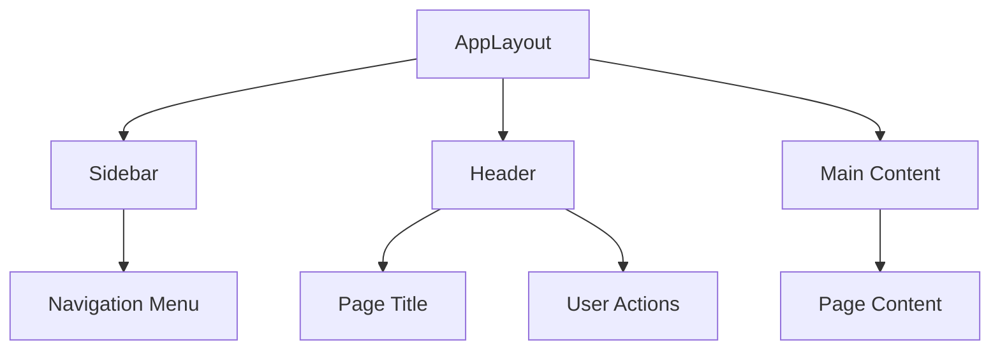
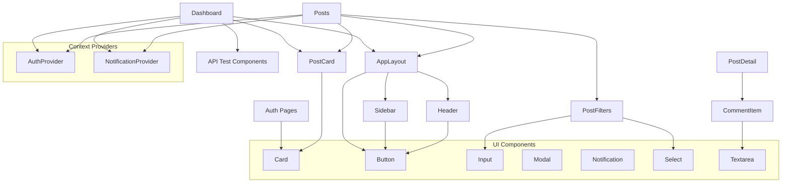

# 컴포넌트 참조 가이드

## 📚 목차
1. [UI 컴포넌트](#ui-컴포넌트)
2. [레이아웃 컴포넌트](#레이아웃-컴포넌트)
3. [기능별 컴포넌트](#기능별-컴포넌트)
4. [컴포넌트 의존성 관계](#컴포넌트-의존성-관계)
5. [사용 예시](#사용-예시)

## 🧩 UI 컴포넌트

### Button
재사용 가능한 버튼 컴포넌트

#### Props
```typescript
interface ButtonProps {
  variant?: "primary" | "secondary" | "danger" | "outline";
  size?: "sm" | "md" | "lg";
  disabled?: boolean;
  loading?: boolean;
  children: React.ReactNode;
  className?: string;
  onClick?: (event: React.MouseEvent<HTMLButtonElement>) => void;
  type?: "button" | "submit" | "reset";
}
```

#### 사용법
```tsx
// 기본 사용
<Button>클릭하세요</Button>

// 변형 및 크기
<Button variant="primary" size="lg">큰 주요 버튼</Button>
<Button variant="outline" size="sm">작은 아웃라인 버튼</Button>

// 로딩 상태
<Button loading={isSubmitting}>
  {isSubmitting ? "처리중..." : "제출"}
</Button>

// 위험 액션
<Button variant="danger" onClick={handleDelete}>
  삭제
</Button>
```

#### 의존성
- `clsx`, `tailwind-merge` (스타일링)
- `forwardRef` (ref 전달)

---

### Input
입력 필드 컴포넌트

#### Props
```typescript
interface InputProps {
  type?: string;
  label?: string;
  placeholder?: string;
  value?: string;
  defaultValue?: string;
  onChange?: (event: React.ChangeEvent<HTMLInputElement>) => void;
  onBlur?: (event: React.FocusEvent<HTMLInputElement>) => void;
  required?: boolean;
  disabled?: boolean;
  error?: string;
  className?: string;
  name?: string;
}
```

#### 사용법
```tsx
// 기본 입력 필드
<Input
  label="이메일"
  type="email"
  placeholder="example@email.com"
  required
/>

// 에러 상태
<Input
  label="비밀번호"
  type="password"
  error="비밀번호는 최소 8자 이상이어야 합니다"
/>

// 제어 컴포넌트
<Input
  label="사용자명"
  value={username}
  onChange={(e) => setUsername(e.target.value)}
/>
```

#### 특징
- 자동 ID 생성
- 라벨과 에러 메시지 내장
- 접근성 지원

---

### Textarea
여러줄 텍스트 입력 컴포넌트

#### Props
```typescript
interface TextareaProps {
  label?: string;
  error?: string;
  rows?: number;
  placeholder?: string;
  value?: string;
  defaultValue?: string;
  onChange?: (event: React.ChangeEvent<HTMLTextAreaElement>) => void;
  onBlur?: (event: React.FocusEvent<HTMLTextAreaElement>) => void;
  required?: boolean;
  disabled?: boolean;
  className?: string;
  name?: string;
}
```

#### 사용법
```tsx
<Textarea
  label="게시글 내용"
  placeholder="내용을 입력하세요..."
  rows={5}
  required
/>
```

---

### Select
선택 드롭다운 컴포넌트

#### Props
```typescript
interface SelectProps {
  label?: string;
  error?: string;
  placeholder?: string;
  value?: string;
  defaultValue?: string;
  onChange?: (event: React.ChangeEvent<HTMLSelectElement>) => void;
  required?: boolean;
  disabled?: boolean;
  className?: string;
  name?: string;
  options: SelectOption[];
}

interface SelectOption {
  value: string;
  label: string;
  disabled?: boolean;
}
```

#### 사용법
```tsx
<Select
  label="카테고리"
  placeholder="카테고리를 선택하세요"
  options={[
    { value: "tech", label: "기술" },
    { value: "design", label: "디자인" },
    { value: "business", label: "비즈니스" }
  ]}
  required
/>
```

---

### Modal
모달 다이얼로그 컴포넌트

#### Props
```typescript
interface ModalProps {
  isOpen: boolean;
  onClose: () => void;
  title?: string;
  children: React.ReactNode;
  className?: string;
  overlayClassName?: string;
  size?: "sm" | "md" | "lg" | "xl";
}
```

#### 사용법
```tsx
<Modal
  isOpen={showModal}
  onClose={() => setShowModal(false)}
  title="게시글 삭제"
  size="sm"
>
  <p>정말로 이 게시글을 삭제하시겠습니까?</p>
  <div className="flex justify-end space-x-2 mt-4">
    <Button variant="outline" onClick={() => setShowModal(false)}>
      취소
    </Button>
    <Button variant="danger" onClick={handleDelete}>
      삭제
    </Button>
  </div>
</Modal>
```

#### 특징
- Portal을 사용한 body 직접 렌더링
- ESC 키로 닫기 지원
- 배경 클릭으로 닫기
- 포커스 트랩

---

### Notification
알림 메시지 컴포넌트

#### Props
```typescript
interface NotificationProps {
  id: string;
  message: string;
  type: "success" | "error" | "info" | "warning";
  duration?: number;
  onRemove: (id: string) => void;
  position?: "top-right" | "top-left" | "bottom-right" | "bottom-left" | "top-center";
}
```

#### 사용법
```tsx
// NotificationContext를 통해 사용
const { showSuccess, showError } = useNotification();

showSuccess("저장되었습니다!");
showError("오류가 발생했습니다.");
```

#### 특징
- 자동 제거 타이머
- 다양한 위치 지원
- 애니메이션 효과

---

### Card
카드 레이아웃 컴포넌트

#### Props
```typescript
interface CardProps {
  children: React.ReactNode;
  className?: string;
  hover?: boolean;
  padding?: "none" | "sm" | "md" | "lg";
}
```

#### 사용법
```tsx
<Card hover padding="lg">
  <Card.Header>
    <Card.Title level={3}>제목</Card.Title>
  </Card.Header>
  <Card.Content>
    <p>카드 내용입니다.</p>
  </Card.Content>
  <Card.Footer>
    <Button>액션</Button>
  </Card.Footer>
</Card>
```

#### 특징
- Compound Component 패턴
- 다양한 패딩 옵션
- 호버 효과 옵션

## 🏗️ 레이아웃 컴포넌트

### AppLayout
메인 애플리케이션 레이아웃

#### Props
```typescript
interface AppLayoutProps {
  children: React.ReactNode;
  title: string;
  subtitle?: string;
  user?: User | null;
  onLogout?: () => void;
}
```

#### 사용법
```tsx
<AppLayout 
  title="대시보드" 
  subtitle="API 개발 현황 및 테스트"
  user={user}
  onLogout={logout}
>
  <DashboardContent />
</AppLayout>
```

#### 구조


#### 특징
- 반응형 사이드바
- 사용자 인증 상태 표시
- 모바일 메뉴 지원

---

### Sidebar
네비게이션 사이드바

#### Props
```typescript
interface SidebarProps {
  isOpen?: boolean;
  onClose?: () => void;
  isAuthenticated?: boolean;
}
```

#### 특징
- 인증 상태에 따른 메뉴 필터링
- 현재 경로 하이라이트
- 모바일 오버레이 지원

---

### Header
페이지 헤더

#### Props
```typescript
interface HeaderProps {
  title: string;
  subtitle?: string;
  user?: User | null;
  onMenuClick?: () => void;
  onLogout?: () => void;
  className?: string;
}
```

#### 특징
- 사용자 드롭다운 메뉴
- 모바일 메뉴 버튼
- 페이지 타이틀 표시

## 🎯 기능별 컴포넌트

### PostCard
게시글 카드 컴포넌트

#### Props
```typescript
interface PostCardProps {
  post: Post;
  onClick?: (post: Post) => void;
  className?: string;
}
```

#### 사용법
```tsx
<PostCard 
  post={post}
  onClick={(post) => navigate(`/posts/${post.slug}`)}
/>
```

#### 특징
- 게시글 메타 정보 표시
- 통계 정보 (조회수, 좋아요 등)
- 태그 표시
- 클릭 이벤트 지원

---

### PostFilters
게시글 필터링 컴포넌트

#### Props
```typescript
interface PostFiltersProps {
  filters: PostFiltersType;
  onFiltersChange: (filters: PostFiltersType) => void;
  className?: string;
}
```

#### 사용법
```tsx
<PostFilters
  filters={currentFilters}
  onFiltersChange={handleFiltersChange}
/>
```

#### 특징
- 타입, 서비스, 정렬 필터
- 실시간 검색 (디바운스)
- 활성 필터 표시
- 필터 초기화

---

### CommentItem
댓글 아이템 컴포넌트

#### Props
```typescript
interface CommentItemProps {
  comment: Comment;
  currentUser?: User | null;
  onReply?: (parentId: number, content: string) => Promise<void>;
  onEdit?: (commentId: number, content: string) => Promise<void>;
  onDelete?: (commentId: number) => Promise<void>;
  onReaction?: (commentId: number, type: "like" | "dislike") => Promise<void>;
  depth?: number;
  maxDepth?: number;
}
```

#### 특징
- 중첩 댓글 지원
- 인라인 편집
- 반응 (좋아요/싫어요)
- 권한 기반 액션 표시

## 🔗 컴포넌트 의존성 관계



## 🎨 스타일링 패턴

### 공통 스타일 함수
```typescript
import { cn } from "~/lib/utils";

// 클래스네임 병합
<div className={cn("base-styles", condition && "conditional-styles", className)} />
```

### Variant 패턴
```typescript
const variants = {
  primary: "bg-blue-600 text-white hover:bg-blue-700",
  secondary: "bg-gray-100 text-gray-900 hover:bg-gray-200",
  danger: "bg-red-600 text-white hover:bg-red-700",
};

className={cn(baseStyles, variants[variant], className)}
```

### 반응형 패턴
```typescript
className="grid grid-cols-1 md:grid-cols-2 lg:grid-cols-4 gap-6"
```

## 🔧 커스텀 훅 활용

### useForm
```tsx
const { values, getFieldProps, handleSubmit, isValid } = useForm({
  initialValues: { email: "", password: "" },
  validate: (values) => {
    const errors: any = {};
    if (!values.email) errors.email = "이메일을 입력해주세요";
    return errors;
  },
  onSubmit: async (values) => {
    await login(values);
  }
});

<Input {...getFieldProps("email")} label="이메일" />
<Button onClick={handleSubmit} disabled={!isValid}>로그인</Button>
```

### useModal
```tsx
const { isOpen, openModal, closeModal } = useModal();

<Button onClick={() => openModal("제목", <ModalContent />)}>
  모달 열기
</Button>

<Modal isOpen={isOpen} onClose={closeModal} title="제목">
  <ModalContent />
</Modal>
```

### usePagination
```tsx
const pagination = usePagination({
  initialPage: 1,
  initialSize: 10,
  totalItems: 100
});

<Button 
  onClick={() => pagination.goToNext()} 
  disabled={!pagination.hasNext}
>
  다음 페이지
</Button>
```

## 📱 접근성 지원

### 키보드 네비게이션
- 모든 상호작용 요소에 키보드 접근 가능
- Tab 순서 최적화
- ESC 키로 모달 닫기

### 스크린 리더 지원
- 적절한 ARIA 라벨
- 의미있는 HTML 구조
- 상태 변경 알림

### 시각적 접근성
- 충분한 색상 대비
- 포커스 인디케이터
- 크기 조절 가능한 텍스트

## 🚀 성능 최적화

### 메모이제이션
```tsx
const MemoizedPostCard = React.memo(PostCard);
const memoizedCallback = useCallback(() => {}, [deps]);
```

### 지연 로딩
```tsx
const LazyComponent = React.lazy(() => import('./Component'));
```

### 가상화
- 긴 목록에 대한 가상화 구현
- 무한 스크롤 지원

이 가이드를 통해 각 컴포넌트의 역할과 사용법을 명확히 이해하고, 일관된 방식으로 활용할 수 있습니다.