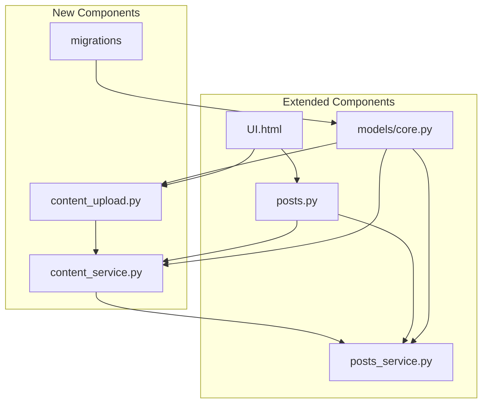

# 에디터 통합 계획서

**작성일**: 2025-06-26  
**목적**: API 개발용 UI에 에디터 통합을 위한 백엔드 API 확장 계획

## 📋 현황 분석 요약

### 현재 구현 상태
- **파일 API**: ✅ 완전 구현 (이미지만 지원, 5MB 제한)
- **텍스트 에디터**: ⚠️ 기본 textarea (플레인 텍스트만)
- **파일 첨부**: ✅ 별도 업로드 후 게시글 연결 방식
- **이미지 표시**: ✅ 게시글 하단 그리드 형태

### 주요 한계점
- 인라인 이미지 삽입 불가
- 리치 텍스트 편집 기능 없음
- 마크다운 지원 없음
- 에디터 내 드래그앤드롭 업로드 불가
- XSS 보안 취약점 존재

### 개발 목표
**API 개발용 UI (`frontend-prototypes/UI.html`)에 에디터 기능 추가**
- 마크다운 에디터 지원
- 인라인 이미지 업로드
- 실시간 미리보기
- 보안 강화된 콘텐츠 처리

## 🎯 8단계 구현 계획

### 1단계: 데이터 모델 확장

#### A. Post 모델 확장 (`models/core.py`)
```python
class Post(Document, PostBase):
    # 기존 필드 유지
    content: str  # 원본 에디터 데이터 (마크다운 등)
    content_type: Literal["text", "markdown", "html"] = "text"
    content_rendered: Optional[str] = None  # 렌더링된 HTML
    word_count: Optional[int] = None
    reading_time: Optional[int] = None  # 분 단위
```

#### B. PostMetadata 확장
```python
class PostMetadata(BaseModel):
    # 기존 필드 유지
    file_ids: Optional[List[str]] = Field(default_factory=list)
    inline_images: Optional[List[str]] = Field(default_factory=list)  # 인라인 이미지 file_ids
    editor_type: Literal["plain", "markdown", "wysiwyg"] = "plain"
```

### 2단계: 콘텐츠 처리 시스템

#### A. 콘텐츠 렌더링 서비스 (`services/content_service.py`)
```python
class ContentService:
    async def render_markdown(self, content: str) -> str:
        # Python-Markdown 기반 마크다운 → HTML 변환
        # 이미지 URL 처리 (/api/files/{file_id} 형식)
        # 코드 블록, 테이블, 링크 지원
        pass
    
    async def sanitize_html(self, html: str) -> str:
        # bleach 기반 XSS 새니타이징
        # 허용된 태그: p, br, strong, em, h1-h6, ul, ol, li, img, a, code, pre
        # 허용된 속성: img[src,alt], a[href,title]
        pass
    
    async def extract_metadata(self, content: str) -> dict:
        # 단어 수 계산 (HTML 태그 제외)
        # 읽기 시간 추정 (분당 200단어 기준)
        # 인라인 이미지 file_id 추출
        pass
    
    async def process_content(self, content: str, content_type: str) -> dict:
        # 전체 콘텐츠 처리 플로우 통합
        # 렌더링 → 새니타이징 → 메타데이터 추출
        pass
```

#### B. 보안 설정
```python
# 허용된 HTML 태그 및 속성
ALLOWED_TAGS = [
    'p', 'br', 'strong', 'em', 'u', 'h1', 'h2', 'h3', 'h4', 'h5', 'h6',
    'ul', 'ol', 'li', 'blockquote', 'code', 'pre', 'hr',
    'img', 'a'
]

ALLOWED_ATTRIBUTES = {
    'img': ['src', 'alt', 'title'],
    'a': ['href', 'title', 'target'],
}

# 이미지 URL 패턴 검증
ALLOWED_IMAGE_PATTERN = r'^/api/files/[a-f0-9-]+$'
```

### 3단계: API 엔드포인트 확장

#### A. 파일 업로드 API 확장 (`routers/content_upload.py`)
```python
# 인라인 업로드 전용 엔드포인트
@router.post("/api/content/upload/inline")
async def upload_inline_image():
    # 즉시 업로드 후 에디터용 응답
    return {
        "file_id": file_id,
        "url": f"/api/files/{file_id}",
        "markdown": f"",
        "html": f''
    }

# 다중 파일 업로드
@router.post("/api/content/upload/batch")
async def upload_multiple_files():
    # 여러 파일 동시 업로드 지원
    pass
```

#### B. 게시글 API 확장 (`routers/posts.py`)
```python
# 콘텐츠 미리보기 엔드포인트
@router.post("/api/posts/preview")
async def preview_content(data: PreviewRequest):
    # 실시간 마크다운 → HTML 변환
    # 새니타이징 적용
    return {
        "content_rendered": rendered_html,
        "word_count": word_count,
        "reading_time": reading_time
    }

# 기존 엔드포인트 응답 확장
@router.get("/{slug}")
async def get_post():
    return {
        # 기존 필드들
        "content": post.content,  # 원본 에디터 데이터
        "content_rendered": post.content_rendered,  # 렌더링된 HTML
        "content_type": post.content_type,
        "word_count": post.word_count,
        "reading_time": post.reading_time
    }
```

### 4단계: 검색 시스템 개선

#### A. 검색 기능 업데이트 (`services/posts_service.py`)
```python
async def search_posts():
    # HTML 태그 제거 후 순수 텍스트 검색
    # 마크다운 구문 제거 (**, __, ## 등)
    # 검색 결과 하이라이팅 (HTML 구조 고려)
    pass
```

#### B. 인덱스 최적화
```python
# 텍스트 검색 전용 필드 추가
class Post(Document):
    content_text: Optional[str] = None  # 순수 텍스트 (검색용)
    
    class Settings:
        indexes = [
            [("content_text", "text")],  # 전문 검색 인덱스
            [("content_type", ASCENDING)],
            [("word_count", DESCENDING)]
        ]
```

### 5단계: 데이터 마이그레이션

#### A. 기존 데이터 변환 (`migrations/add_content_fields.py`)
```python
async def migrate_existing_posts():
    """기존 게시글을 새로운 스키마로 마이그레이션"""
    async for post in Post.find_all():
        # content_type을 "text"로 설정
        post.content_type = "text"
        
        # HTML 이스케이프 처리
        post.content_rendered = html.escape(post.content).replace('\n', '<br>')
        
        # 메타데이터 추출
        post.word_count = len(post.content.split())
        post.reading_time = max(1, post.word_count // 200)
        post.content_text = post.content
        
        await post.save()
```

#### B. 롤백 스크립트
```python
async def rollback_migration():
    """마이그레이션 롤백"""
    async for post in Post.find_all():
        # 새로 추가된 필드 제거
        unset_data = {
            "content_type": 1,
            "content_rendered": 1,
            "word_count": 1,
            "reading_time": 1,
            "content_text": 1
        }
        await post.update({"$unset": unset_data})
```

### 6단계: 프론트엔드 에디터 통합

#### A. 마크다운 에디터 추가 (`frontend-prototypes/UI.html`)
```javascript
// EasyMDE 또는 SimpleMDE 사용
const editor = new EasyMDE({
    element: document.getElementById("post-content"),
    uploadImage: true,
    imageUploadFunction: uploadInlineImage,
    spellChecker: false,
    autosave: {
        enabled: true,
        uniqueId: "post_draft",
        delay: 1000,
    },
    toolbar: [
        "bold", "italic", "heading", "|",
        "quote", "unordered-list", "ordered-list", "|",
        "link", "image", "|",
        "preview", "side-by-side", "fullscreen"
    ]
});
```

#### B. 드래그앤드롭 업로드
```javascript
// 에디터 영역 드롭 핸들러
editor.codemirror.on("drop", async (cm, e) => {
    e.preventDefault();
    const files = e.dataTransfer.files;
    
    for (let file of files) {
        if (file.type.startsWith('image/')) {
            const result = await uploadInlineImage(file);
            const cursor = cm.getCursor();
            cm.replaceRange(`\n\n`, cursor);
        }
    }
});

// 인라인 이미지 업로드 함수
async function uploadInlineImage(file) {
    const formData = new FormData();
    formData.append('file', file);
    
    const response = await fetch('/api/content/upload/inline', {
        method: 'POST',
        headers: {
            'Authorization': `Bearer ${getAuthToken()}`
        },
        body: formData
    });
    
    return await response.json();
}
```

#### C. 실시간 미리보기
```javascript
// 미리보기 함수
async function previewContent() {
    const content = editor.value();
    const response = await fetch('/api/posts/preview', {
        method: 'POST',
        headers: {
            'Content-Type': 'application/json',
            'Authorization': `Bearer ${getAuthToken()}`
        },
        body: JSON.stringify({
            content: content,
            content_type: 'markdown'
        })
    });
    
    const result = await response.json();
    document.getElementById('preview-area').innerHTML = result.content_rendered;
}
```

### 7단계: 성능 최적화

#### A. 캐싱 시스템
```python
from functools import lru_cache
import hashlib

@lru_cache(maxsize=1000)
def render_markdown_cached(content_hash: str, content: str) -> str:
    """캐시된 마크다운 렌더링"""
    return render_markdown(content)

def get_content_hash(content: str) -> str:
    """콘텐츠 해시 생성"""
    return hashlib.md5(content.encode()).hexdigest()
```

#### B. 이미지 최적화
```python
async def optimize_uploaded_image(file_path: str):
    """업로드된 이미지 최적화"""
    # WebP 변환 (선택적)
    # 썸네일 생성
    # EXIF 메타데이터 제거
    # 압축 최적화
    pass
```

### 8단계: 테스트 및 검증

#### A. API 테스트
- 콘텐츠 타입별 렌더링 테스트
- XSS 공격 시나리오 테스트
- 인라인 업로드 보안 테스트
- 성능 테스트 (대용량 콘텐츠)

#### B. UI 테스트
- 에디터 기능 테스트
- 드래그앤드롭 업로드 테스트
- 실시간 미리보기 테스트
- 브라우저 호환성 테스트

## 🚀 구현 우선순위

### Phase 1 (필수) - 마크다운 지원
1. ✅ Post 모델 확장 (content_type, content_rendered)
2. ✅ 마크다운 렌더링 서비스
3. ✅ HTML 새니타이징
4. ✅ 기본 마크다운 에디터 (EasyMDE)
5. ✅ 인라인 이미지 업로드 API

### Phase 2 (개선) - 고급 기능
1. ✅ 드래그앤드롭 업로드
2. ✅ 실시간 미리보기
3. ✅ 자동 저장 기능
4. ✅ 검색 시스템 개선

### Phase 3 (확장) - 최적화
1. ⏳ 이미지 최적화
2. ⏳ 캐싱 시스템
3. ⏳ 성능 모니터링
4. ⏳ 고급 에디터 기능

## 📊 모듈 관계도



## 🔧 기술 스택

### 백엔드
- **마크다운 처리**: Python-Markdown
- **HTML 새니타이징**: bleach
- **이미지 처리**: Pillow (선택적)
- **캐싱**: functools.lru_cache

### 프론트엔드
- **에디터**: EasyMDE (SimpleMDE 후속)
- **파일 업로드**: Fetch API + FormData
- **미리보기**: 실시간 API 호출

## 🛡️ 보안 고려사항

### XSS 방지
- 서버사이드 HTML 새니타이징 (bleach)
- 허용된 태그/속성만 유지
- 이미지 URL 패턴 검증

### 파일 업로드 보안
- 파일 타입 검증 강화
- 크기 제한 유지 (5MB)
- 파일명 새니타이징

### 인증/권한
- JWT 토큰 기반 인증 유지
- 업로드 권한 검증
- 파일 소유권 확인

## 📋 구현 순서 (의존성 고려)

1. **모델 확장** → **콘텐츠 서비스** → **업로드 API**
2. **게시글 API/서비스 확장** (콘텐츠 서비스 완료 후)
3. **데이터 마이그레이션** (모델/서비스 완료 후)
4. **UI 통합** (API 완료 후)

## 🎯 예상 성과

### 사용자 경험 개선
- 리치 텍스트 편집 가능
- 인라인 이미지 삽입
- 실시간 미리보기
- 직관적인 마크다운 에디터

### 개발자 경험 개선
- API 테스트 편의성 향상
- 콘텐츠 관리 효율성 증대
- 확장 가능한 에디터 시스템

### 시스템 안정성
- XSS 공격 방지
- 구조화된 콘텐츠 관리
- 확장 가능한 아키텍처

이 계획은 현재 구현된 견고한 파일 API 시스템을 기반으로 점진적으로 에디터 기능을 향상시키는 방향으로 설계되었습니다.