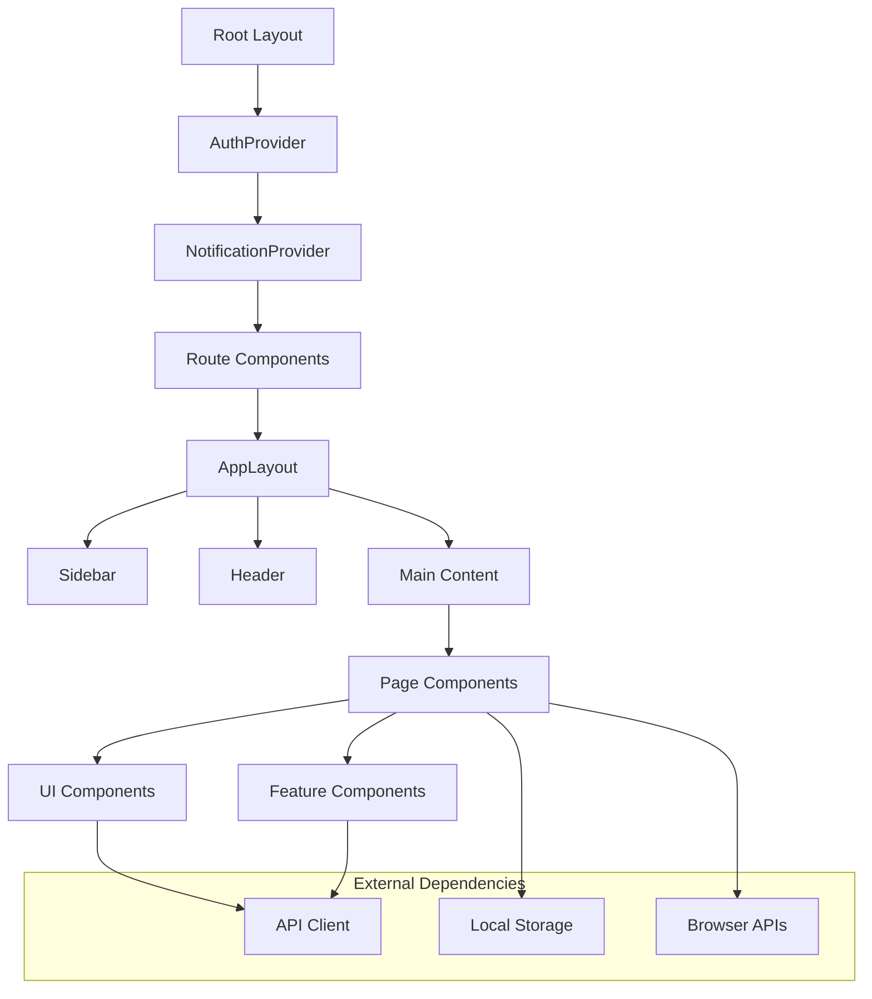
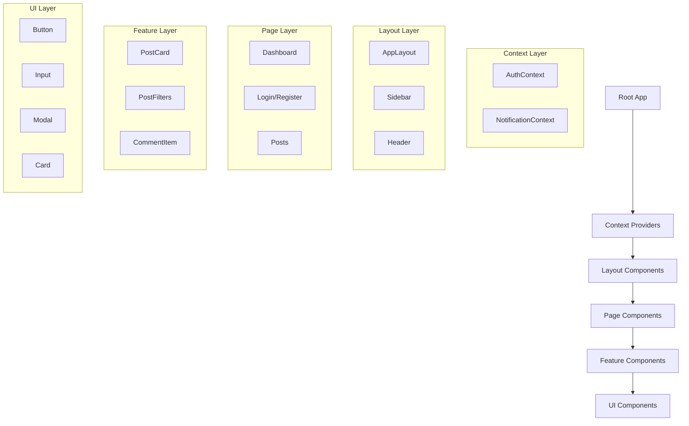
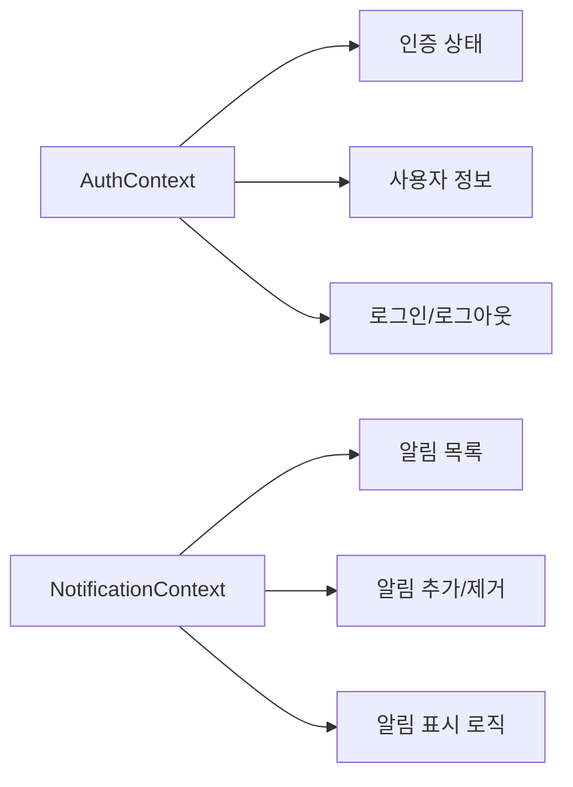
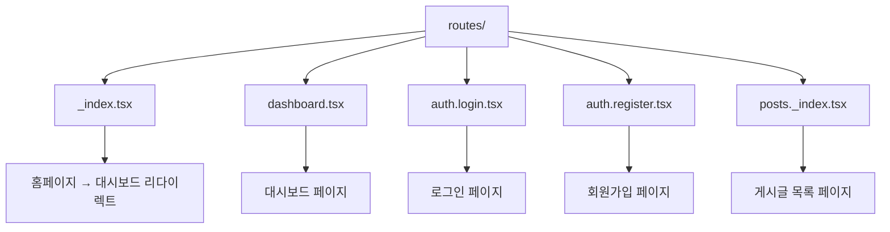
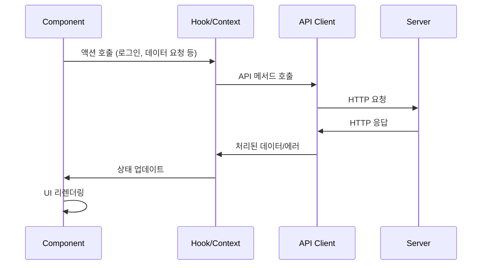
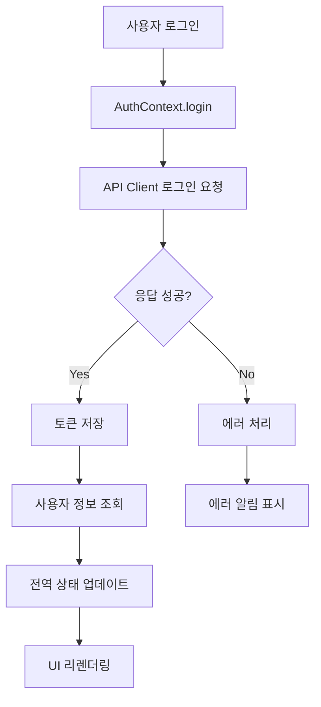
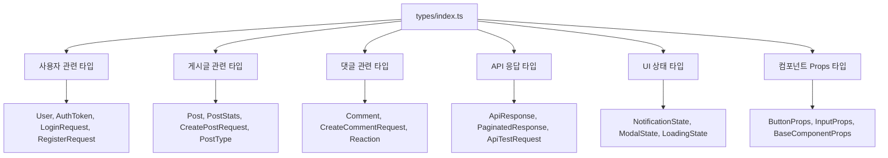

# 프론트엔드 아키텍처 문서

## 📚 목차
1. [전체 구조 개요](#전체-구조-개요)
2. [폴더 구조](#폴더-구조)
3. [컴포넌트 아키텍처](#컴포넌트-아키텍처)
4. [상태 관리](#상태-관리)
5. [라우팅 시스템](#라우팅-시스템)
6. [데이터 플로우](#데이터-플로우)
7. [타입 시스템](#타입-시스템)
8. [스타일링](#스타일링)

## 🏗️ 전체 구조 개요



## 📁 폴더 구조

```
frontend/
├── app/
│   ├── components/           # 재사용 가능한 컴포넌트
│   │   ├── ui/              # 기본 UI 컴포넌트
│   │   │   ├── Button.tsx
│   │   │   ├── Input.tsx
│   │   │   ├── Modal.tsx
│   │   │   ├── Notification.tsx
│   │   │   ├── Card.tsx
│   │   │   ├── Select.tsx
│   │   │   └── Textarea.tsx
│   │   ├── layout/          # 레이아웃 컴포넌트
│   │   │   ├── AppLayout.tsx
│   │   │   ├── Sidebar.tsx
│   │   │   └── Header.tsx
│   │   ├── post/            # 게시글 관련 컴포넌트
│   │   │   ├── PostCard.tsx
│   │   │   └── PostFilters.tsx
│   │   └── comment/         # 댓글 관련 컴포넌트
│   │       └── CommentItem.tsx
│   ├── contexts/            # React Context 프로바이더
│   │   ├── AuthContext.tsx
│   │   └── NotificationContext.tsx
│   ├── hooks/               # 커스텀 훅
│   │   ├── useForm.ts
│   │   ├── useModal.ts
│   │   ├── useLocalStorage.ts
│   │   ├── useDebounce.ts
│   │   └── usePagination.ts
│   ├── lib/                 # 유틸리티 및 설정
│   │   ├── api.ts           # API 클라이언트
│   │   ├── utils.ts         # 공통 유틸리티
│   │   └── constants.ts     # 상수 정의
│   ├── routes/              # 페이지 라우트
│   │   ├── _index.tsx       # 홈 (→ 대시보드 리다이렉트)
│   │   ├── dashboard.tsx    # 대시보드
│   │   ├── auth.login.tsx   # 로그인
│   │   ├── auth.register.tsx# 회원가입
│   │   └── posts._index.tsx # 게시글 목록
│   ├── types/               # TypeScript 타입 정의
│   │   └── index.ts
│   ├── root.tsx             # 루트 레이아웃
│   └── tailwind.css         # 스타일시트
├── public/                  # 정적 파일
├── package.json
└── vite.config.ts
```

## 🧩 컴포넌트 아키텍처

### 계층 구조



### 컴포넌트 분류

#### 1. UI 컴포넌트 (`components/ui/`)
- **목적**: 재사용 가능한 기본 UI 요소
- **특징**: 
  - 비즈니스 로직 없음
  - 순수 presentational 컴포넌트
  - 일관된 디자인 시스템
- **예시**: Button, Input, Modal, Card

#### 2. 레이아웃 컴포넌트 (`components/layout/`)
- **목적**: 페이지 구조 정의
- **특징**:
  - 전체적인 레이아웃 관리
  - 네비게이션 로직 포함
  - 반응형 디자인 처리
- **예시**: AppLayout, Sidebar, Header

#### 3. 기능별 컴포넌트 (`components/post/`, `components/comment/`)
- **목적**: 특정 도메인 기능 구현
- **특징**:
  - 비즈니스 로직 포함
  - API 호출 및 상태 관리
  - 도메인별 그룹화
- **예시**: PostCard, PostFilters, CommentItem

## 🔄 상태 관리

### Context API 기반 전역 상태



#### AuthContext
```typescript
interface AuthContextType {
  user: User | null;
  token: string | null;
  login: (credentials: LoginRequest) => Promise<void>;
  register: (data: RegisterRequest) => Promise<void>;
  logout: () => void;
  isLoading: boolean;
  isAuthenticated: boolean;
}
```

#### NotificationContext
```typescript
interface NotificationContextType {
  notifications: NotificationState[];
  addNotification: (notification: Omit<NotificationState, "id">) => void;
  removeNotification: (id: string) => void;
  clearNotifications: () => void;
  showSuccess: (message: string, duration?: number) => void;
  showError: (message: string, duration?: number) => void;
  showInfo: (message: string, duration?: number) => void;
  showWarning: (message: string, duration?: number) => void;
}
```

### 로컬 상태 관리

#### 1. useState
- 컴포넌트 내부 상태
- 단순한 UI 상태 관리

#### 2. 커스텀 훅
- `useForm`: 폼 상태 및 유효성 검사
- `useModal`: 모달 상태 관리
- `usePagination`: 페이지네이션 로직
- `useLocalStorage`: 로컬 스토리지 동기화

## 🛣️ 라우팅 시스템

### Remix 파일 기반 라우팅



### 라우트 구조

| 경로 | 파일 | 설명 |
|------|------|------|
| `/` | `_index.tsx` | 홈 → 대시보드 리다이렉트 |
| `/dashboard` | `dashboard.tsx` | 대시보드 및 API 테스트 |
| `/auth/login` | `auth.login.tsx` | 로그인 페이지 |
| `/auth/register` | `auth.register.tsx` | 회원가입 페이지 |
| `/posts` | `posts._index.tsx` | 게시글 목록 |

### 네비게이션 구조

```typescript
const NAV_ITEMS = [
  {
    id: 'dashboard',
    label: '대시보드',
    icon: '📊',
    path: '/dashboard',
    section: '메인',
  },
  {
    id: 'login',
    label: '로그인',
    icon: '🔐',
    path: '/auth/login',
    section: '인증',
    requiresGuest: true,
  },
  // ... 기타 메뉴 항목
];
```

## 📊 데이터 플로우

### API 통신 플로우



### 인증 플로우



## 🏷️ 타입 시스템

### 타입 구조



### 주요 타입 예시

```typescript
// 기본 엔티티 타입
interface User {
  id: string;
  email: string;
  user_handle?: string;
  display_name?: string;
  created_at: string;
  updated_at: string;
}

// API 응답 타입
interface ApiResponse<T = any> {
  success: boolean;
  data?: T;
  message?: string;
  error?: string;
  timestamp: string;
}

// 컴포넌트 Props 타입
interface ButtonProps extends BaseComponentProps {
  variant?: "primary" | "secondary" | "danger" | "outline";
  size?: "sm" | "md" | "lg";
  disabled?: boolean;
  loading?: boolean;
  onClick?: (event: React.MouseEvent<HTMLButtonElement>) => void;
  type?: "button" | "submit" | "reset";
}
```

## 🎨 스타일링

### Tailwind CSS 기반 스타일링

#### 설계 원칙
1. **유틸리티 우선**: Tailwind CSS 클래스 활용
2. **일관성**: 디자인 시스템 기반 컬러/스페이싱
3. **반응형**: 모바일 우선 반응형 디자인
4. **성능**: CSS-in-JS 대신 정적 CSS 생성

#### 스타일 구조

```mermaid
graph TB
    A[tailwind.css] --> B[Base Styles]
    A --> C[Component Styles]
    A --> D[Utility Classes]
    
    E[cn() 함수] --> F[clsx]
    E --> G[tailwind-merge]
    
    H[컴포넌트] --> E
    H --> I[Tailwind Classes]
```

#### 공통 유틸리티

```typescript
// className 병합 유틸리티
export function cn(...inputs: ClassValue[]) {
  return twMerge(clsx(inputs));
}

// 사용 예시
<button 
  className={cn(
    "base-button-styles",
    variant === "primary" && "primary-styles",
    disabled && "disabled-styles",
    className
  )}
>
```

### 컴포넌트 스타일 패턴

#### 1. Variant 기반 스타일링
```typescript
const variants = {
  primary: "bg-blue-600 text-white hover:bg-blue-700",
  secondary: "bg-gray-100 text-gray-900 hover:bg-gray-200",
  danger: "bg-red-600 text-white hover:bg-red-700",
};
```

#### 2. 반응형 디자인
```typescript
className="grid grid-cols-1 md:grid-cols-2 lg:grid-cols-4 gap-6"
```

#### 3. 상태 기반 스타일링
```typescript
className={cn(
  "transition-colors",
  isActive ? "bg-blue-50 text-blue-700" : "text-gray-600 hover:bg-gray-50"
)}
```

## 🔧 주요 설계 패턴

### 1. Container/Presentational 패턴
- **Container**: 비즈니스 로직, 상태 관리
- **Presentational**: UI 렌더링, 이벤트 전달

### 2. Custom Hook 패턴
- 로직 재사용을 위한 커스텀 훅 활용
- 컴포넌트에서 비즈니스 로직 분리

### 3. Compound Component 패턴
```typescript
<Card>
  <Card.Header>
    <Card.Title>제목</Card.Title>
  </Card.Header>
  <Card.Content>내용</Card.Content>
</Card>
```

### 4. Provider 패턴
- Context API를 활용한 상태 공유
- 의존성 주입 방식의 서비스 제공

## 📈 성능 최적화

### 1. 코드 분할
- Remix의 자동 코드 분할 활용
- 동적 import로 추가 분할 가능

### 2. 메모이제이션
```typescript
const MemoizedComponent = React.memo(Component);
const memoizedValue = useMemo(() => expensiveOperation(), [deps]);
const memoizedCallback = useCallback(() => {}, [deps]);
```

### 3. 가상화
- 긴 목록에 대한 가상화 구현 (react-window 등)

### 4. 이미지 최적화
- 지연 로딩 (lazy loading)
- 적절한 이미지 포맷 및 크기

## 🧪 테스팅 전략

### 1. 단위 테스트
- 순수 함수 및 훅 테스트
- 컴포넌트 개별 기능 테스트

### 2. 통합 테스트
- 컴포넌트 간 상호작용 테스트
- Context Provider 포함 테스트

### 3. E2E 테스트
- 사용자 플로우 기반 테스트
- 주요 기능 시나리오 검증

## 🔒 보안 고려사항

### 1. 인증 토큰 관리
- localStorage 사용 (XSS 취약점 주의)
- 토큰 만료 시간 관리
- 자동 로그아웃 구현

### 2. XSS 방지
- React의 기본 이스케이핑 활용
- dangerouslySetInnerHTML 사용 금지

### 3. HTTPS 통신
- 모든 API 통신 HTTPS 강제
- 민감 정보 URL 파라미터 제외

이 아키텍처는 확장 가능하고 유지보수가 용이한 프론트엔드 애플리케이션을 위해 설계되었습니다.