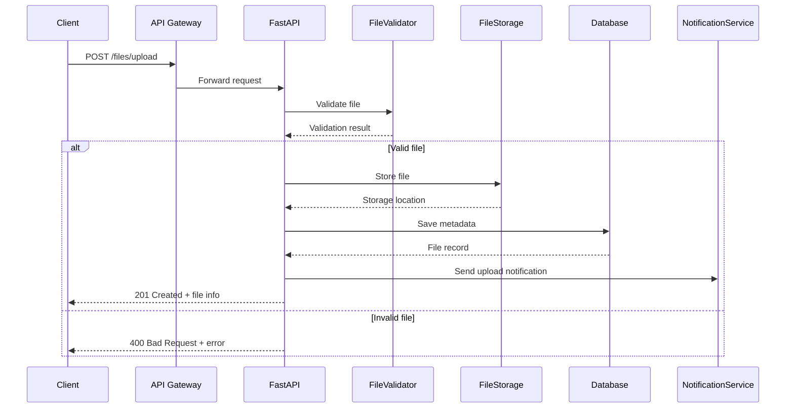

# FastAPI 파일 첨부 API - TDD 체계 적용

## 1. 개발 차원

### 1.1 기능 플로우 (사용자 관점)
```
사용자 → 파일 선택 → 업로드 버튼 클릭 → 
진행률 표시 → 업로드 완료 → 파일 정보 확인 → 
다운로드/삭제 옵션 제공
```

### 1.2 시퀀스 다이어그램 (시스템 차원)


## 2. UX 차원

### 2.1 사용자 시나리오
**주 시나리오:**
- 마케팅 담당자가 캠페인 이미지를 업로드
- 개발자가 배포용 패키지 파일을 업로드
- 고객이 지원 요청에 첨부 파일 업로드

**사용자 경험 요구사항:**
- 드래그 앤 드롭 지원
- 실시간 업로드 진행률 표시
- 파일 형식/크기 제한 안내
- 업로드 실패 시 명확한 오류 메시지

## 3. 테스트 코드 구상

### 3.1 테스트 계층 및 우선순위

#### 단위 테스트 (우선순위: 높음)
**대상:** 개별 함수/메서드
**의존성:** 없음 (Mock 사용)

1. **파일 검증 로직**
   - **테스트 전:** 검증되지 않은 파일 데이터
   - **테스트 후:** 검증 결과 (성공/실패) 및 오류 메시지

2. **파일 메타데이터 추출**
   - **테스트 전:** 원본 파일
   - **테스트 후:** 파일명, 크기, MIME 타입, 해시값

3. **파일명 중복 처리**
   - **테스트 전:** 중복 가능한 파일명
   - **테스트 후:** 고유한 파일명 생성

#### 통합 테스트 (우선순위: 중간)
**대상:** API 엔드포인트와 의존 서비스
**의존성:** 실제 데이터베이스, 파일 시스템

1. **파일 업로드 API**
   - **테스트 전:** 클라이언트 요청 (multipart/form-data)
   - **테스트 후:** HTTP 201 응답, 파일 저장됨, DB 레코드 생성

2. **파일 다운로드 API**
   - **테스트 전:** 저장된 파일 ID
   - **테스트 후:** 파일 스트림 응답, 올바른 Content-Type

3. **파일 삭제 API**
   - **테스트 전:** 존재하는 파일 ID
   - **테스트 후:** 파일 물리적 삭제, DB 레코드 삭제

#### E2E 테스트 (우선순위: 낮음)
**대상:** 전체 사용자 워크플로우
**의존성:** 전체 시스템 환경

1. **전체 파일 라이프사이클**
   - **테스트 전:** 사용자가 브라우저에서 파일 선택
   - **테스트 후:** 업로드→조회→다운로드→삭제 완료

### 3.2 실패 시나리오 테스트

#### 단위 테스트
```python
# 파일 크기 초과
def test_file_size_validation_exceeds_limit():
    # Given: 10MB 제한, 15MB 파일
    # When: 검증 실행
    # Then: ValidationError 발생, "파일 크기 초과" 메시지

# 지원하지 않는 파일 형식
def test_unsupported_file_type():
    # Given: 이미지만 허용, .exe 파일 업로드
    # When: MIME 타입 검증
    # Then: ValidationError 발생, "지원하지 않는 형식" 메시지
```

#### 통합 테스트
```python
# 디스크 공간 부족
def test_upload_when_disk_full():
    # Given: 디스크 용량 부족 상황 모킹
    # When: 파일 업로드 시도
    # Then: HTTP 507 응답, "저장 공간 부족" 메시지

# 동시 업로드 충돌
def test_concurrent_upload_same_filename():
    # Given: 동일한 파일명으로 동시 업로드
    # When: 두 요청이 거의 동시에 처리
    # Then: 둘 다 성공, 서로 다른 고유 파일명 생성
```

### 3.3 테스트 데이터 관리

#### 픽스처 설계
```python
@pytest.fixture
def sample_files():
    return {
        'valid_image': create_test_image(1024, 768, 'image/jpeg'),
        'oversized_file': create_test_file(11 * 1024 * 1024),  # 11MB
        'malicious_file': create_test_file_with_script(),
        'empty_file': create_empty_file()
    }

@pytest.fixture
def file_storage_mock():
    with patch('app.services.FileStorage') as mock:
        yield mock
```

### 3.4 성능 및 보안 테스트

#### 성능 테스트
```python
def test_upload_performance_large_file():
    # Given: 100MB 파일
    # When: 업로드 실행
    # Then: 30초 이내 완료, 메모리 사용량 500MB 미만

def test_concurrent_upload_load():
    # Given: 10개 동시 업로드
    # When: 병렬 처리
    # Then: 모두 성공, 응답시간 증가율 50% 미만
```

#### 보안 테스트
```python
def test_malicious_file_upload():
    # Given: 스크립트가 포함된 파일
    # When: 업로드 시도
    # Then: 파일 거부, 보안 로그 기록

def test_path_traversal_attack():
    # Given: "../../../etc/passwd" 형태의 파일명
    # When: 업로드 시도
    # Then: 파일명 정규화, 안전한 경로로 저장
```

## 4. 보완된 체계의 추가 요소

### 4.1 테스트 의존성 매트릭스
```
단위 테스트 → 통합 테스트 → E2E 테스트
     ↓            ↓           ↓
성능 테스트 ← 보안 테스트 ← 사용성 테스트
```

### 4.2 리팩토링 안전성 체크리스트
- [ ] 모든 단위 테스트 통과
- [ ] API 계약 불변성 유지
- [ ] 성능 회귀 없음
- [ ] 보안 정책 준수
- [ ] 기존 파일 접근성 유지

### 4.3 테스트 자동화 파이프라인
```yaml
# CI/CD 단계별 테스트
- 코드 커밋: 단위 테스트 + 린트
- PR 생성: 통합 테스트 + 보안 스캔
- 스테이징 배포: E2E 테스트 + 성능 테스트
- 프로덕션 배포: 스모크 테스트
```

## 5. 구현 예시 코드

### 5.1 단위 테스트 예시
```python
# tests/unit/test_file_validator.py
import pytest
from app.services.file_validator import FileValidator
from app.exceptions import ValidationError

class TestFileValidator:
    def test_validate_file_size_within_limit(self):
        # Given
        validator = FileValidator(max_size=5*1024*1024)  # 5MB
        file_data = b"x" * (3*1024*1024)  # 3MB
        
        # When
        result = validator.validate_size(file_data)
        
        # Then
        assert result is True

    def test_validate_file_size_exceeds_limit(self):
        # Given
        validator = FileValidator(max_size=5*1024*1024)
        file_data = b"x" * (7*1024*1024)  # 7MB
        
        # When & Then
        with pytest.raises(ValidationError) as exc_info:
            validator.validate_size(file_data)
        assert "파일 크기가 제한을 초과했습니다" in str(exc_info.value)
```

### 5.2 통합 테스트 예시
```python
# tests/integration/test_file_upload_api.py
import pytest
from fastapi.testclient import TestClient
from app.main import app

class TestFileUploadAPI:
    def test_upload_valid_file(self, client: TestClient, sample_image):
        # Given
        files = {"file": ("test.jpg", sample_image, "image/jpeg")}
        
        # When
        response = client.post("/files/upload", files=files)
        
        # Then
        assert response.status_code == 201
        data = response.json()
        assert "file_id" in data
        assert data["filename"] == "test.jpg"
        assert data["size"] > 0
```

이 체계는 TDD의 핵심인 '테스트 우선 개발'을 지원하면서, 개발자가 기능의 전체적 맥락을 이해하고 체계적으로 테스트를 구성할 수 있도록 돕습니다.