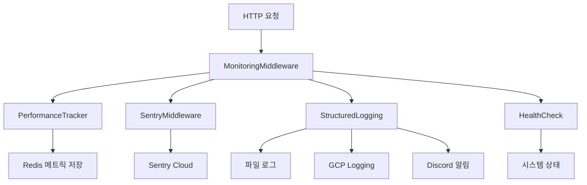
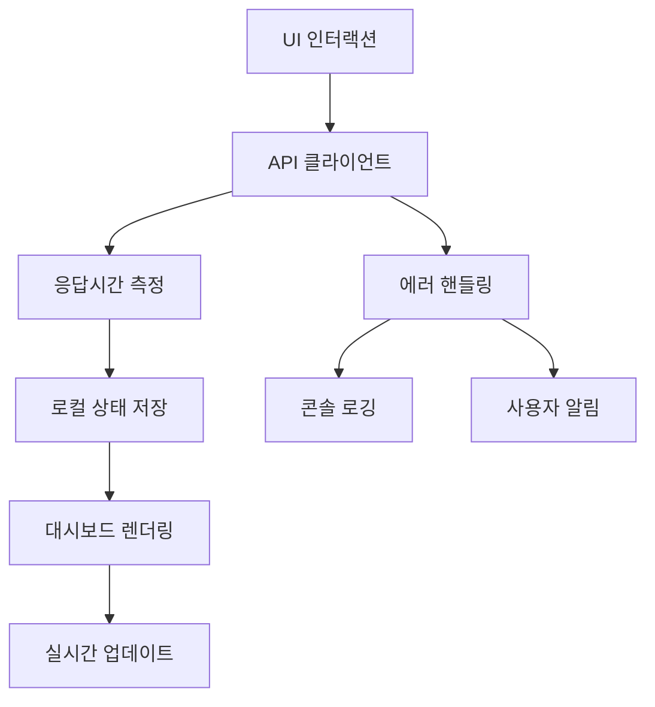

# 실제 측정 지표 상세 분석

**작성일:** 2025년 7월 13일  
**프로젝트:** XAI Community v5  
**분석 목적:** 각 패키지/프레임워크별 실제로 수집되는 지표 매핑

---

## 1. 백엔드 모니터링 지표

### 1.1 Redis 기반 성능 메트릭 (`PerformanceTracker`)

#### 📊 실시간 수집 지표

| **지표 카테고리** | **구체적 지표** | **Redis Key** | **데이터 타입** | **보존 기간** |
|---|---|---|---|---|
| **엔드포인트 통계** | 요청 수 (endpoint별) | `api:metrics:endpoints` | Hash | 무제한 |
| **상태코드 통계** | 요청 수 (status별) | `api:metrics:status_codes` | Hash | 무제한 |
| **응답시간 데이터** | 개별 요청 응답시간 | `api:timing:{method}:{path}` | List | 24시간 |
| **느린 요청 알림** | 2초+ 요청 목록 | `api:alerts:slow_requests` | List | 최근 100개 |

#### 📈 계산되는 파생 지표

| **파생 지표** | **계산 방식** | **용도** |
|---|---|---|
| **평균 응답시간** | `sum(response_times) / count` | 성능 추세 분석 |
| **최소/최대 응답시간** | `min(response_times)` / `max(response_times)` | 성능 범위 파악 |
| **에러율** | `5xx_requests / total_requests` | 시스템 안정성 |
| **가용성** | `2xx_requests / total_requests` | 서비스 품질 |
| **인기 엔드포인트** | `sort(endpoints, request_count DESC)` | 트래픽 분석 |

#### 🚨 실시간 임계값 모니터링

```python
# 실제 코드에서 구현된 임계값
SLOW_REQUEST_THRESHOLD = 2.0  # 2초
ERROR_RATE_THRESHOLD = 0.05   # 5%
MAX_DATA_POINTS = 1000        # 최대 데이터 포인트
RETENTION_HOURS = 24          # 24시간 보존
```

#### 📋 실제 저장되는 메트릭 데이터 구조

```json
// 응답시간 데이터 (api:timing:{endpoint})
{
  "response_time": 0.234,
  "timestamp": 1673456789.123,
  "status_code": 200
}

// 느린 요청 데이터 (api:alerts:slow_requests)
{
  "endpoint": "GET:/api/posts",
  "response_time": 2.456,
  "timestamp": 1673456789.123,
  "status_code": 200,
  "user_agent": "Mozilla/5.0...",
  "client_ip": "192.168.1.1"
}
```

---

### 1.2 Sentry SDK 지표

#### 🎯 자동 수집 지표

| **지표 카테고리** | **구체적 지표** | **수집 방식** | **샘플링 비율** |
|---|---|---|---|
| **에러 추적** | 예외 스택 트레이스 | 자동 캐치 | 100% |
| **성능 트랜잭션** | HTTP 요청 추적 | FastAPI Integration | 100% |
| **사용자 컨텍스트** | JWT 기반 사용자 식별 | 커스텀 미들웨어 | 100% |
| **요청 컨텍스트** | HTTP 메서드, URL, 헤더 | 커스텀 미들웨어 | 100% |

#### 📝 Sentry 컨텍스트 데이터

```python
# 실제 설정되는 Sentry 컨텍스트
sentry_sdk.set_context("request", {
    "method": "GET",
    "url": "https://api.example.com/posts",
    "headers": {...},
    "client_ip": "192.168.1.1"
})

sentry_sdk.set_user({
    "id": "user_123",
    "email": "user@example.com"
})

sentry_sdk.set_tag("request.duration", "1.234s")
sentry_sdk.set_tag("response.status_code", 200)
```

---

### 1.3 구조화된 로깅 시스템

#### 📊 로그 메트릭 분류

| **로그 레벨** | **측정 지표** | **출력 대상** | **알림 조건** |
|---|---|---|---|
| **DEBUG** | 디버깅 정보 | 파일, 콘솔 | 없음 |
| **INFO** | 일반 정보, 성능 로그 | 파일, 콘솔, GCP | 없음 |
| **WARNING** | 경고 사항 | 파일, 콘솔, GCP | 없음 |
| **ERROR** | 에러 발생 | 파일, 콘솔, GCP, Discord | 즉시 알림 |
| **CRITICAL** | 치명적 에러 | 파일, 콘솔, GCP, Discord | 즉시 알림 |

#### 🏷️ 에러 유형 분류 (8개 카테고리)

```python
class ErrorType(Enum):
    SYSTEM_ERROR = "system_error"           # 시스템 내부 오류
    BUSINESS_ERROR = "business_error"       # 비즈니스 로직 오류  
    VALIDATION_ERROR = "validation_error"   # 입력 검증 오류
    AUTHENTICATION_ERROR = "authentication_error"  # 인증 오류
    AUTHORIZATION_ERROR = "authorization_error"    # 권한 오류
    EXTERNAL_API_ERROR = "external_api_error"      # 외부 API 오류
    DATABASE_ERROR = "database_error"       # 데이터베이스 오류
    PERFORMANCE_ERROR = "performance_error" # 성능 관련 오류
```

#### 📈 성능 로그 지표

```python
# 실제 수집되는 성능 지표
@dataclass
class PerformanceInfo:
    duration: float              # 실행 시간 (초)
    operation: str              # 작업 이름
    endpoint: Optional[str]     # API 엔드포인트
    slow_query: bool           # 1초+ 쿼리 여부
    memory_usage: Optional[int] # 메모리 사용량 (MB)
```

#### 🔍 컨텍스트 정보

```python
# 모든 로그에 포함되는 컨텍스트
@dataclass
class LogContext:
    user_id: Optional[str]      # 사용자 ID
    session_id: Optional[str]   # 세션 ID
    request_id: Optional[str]   # 요청 ID (UUID)
    endpoint: Optional[str]     # API 엔드포인트
    method: Optional[str]       # HTTP 메서드
    ip_address: Optional[str]   # 클라이언트 IP
    user_agent: Optional[str]   # User-Agent
    environment: Optional[str]  # 환경 (dev/staging/prod)
```

---

### 1.4 헬스체크 시스템

#### 🏥 종합 헬스체크 지표

| **체크 항목** | **측정 지표** | **판정 기준** | **응답 시간** |
|---|---|---|---|
| **데이터베이스** | MongoDB ping | 연결 성공/실패 | < 100ms |
| **Redis** | Redis ping | 연결 성공/실패 | < 50ms |
| **외부 API** | HTTP 연결성 | 200 응답 | < 5초 |
| **전체 상태** | 모든 체크 결과 | healthy/unhealthy | 종합 판정 |

#### 📊 실제 헬스체크 응답 구조

```json
{
  "status": "healthy",
  "overall_health": true,
  "checks": {
    "database": {
      "status": "healthy",
      "response_time": 0.045,
      "message": "Database connection successful"
    },
    "redis": {
      "status": "healthy", 
      "response_time": 0.023,
      "message": "Redis connection successful"
    },
    "external_apis": {
      "status": "healthy",
      "response_time": 1.234,
      "message": "External API connectivity successful"
    }
  },
  "total_response_time": 1.302,
  "timestamp": "2025-07-13T10:30:00.000Z",
  "version": "1.0.0"
}
```

#### 🔍 캐시 시스템 지표

```json
// cache_service.get_cache_stats() 반환 데이터
{
  "cache_enabled": true,
  "redis_status": "healthy",
  "redis_info": {
    "status": "healthy",
    "redis_type": "upstash",        // 또는 "local"
    "key_prefix": "prod:",          // 환경별 프리픽스
    "connection_pool_size": 10,
    "response_time": 0.023
  }
}
```

---

### 1.5 UptimeRobot 연동 지표

#### 🌐 외부 업타임 모니터링

| **측정 지표** | **수집 간격** | **데이터 소스** | **보존 기간** |
|---|---|---|---|
| **응답 시간** | 5분 | UptimeRobot API | 30일 |
| **가용성 비율** | 실시간 | UptimeRobot API | 90일 |
| **다운타임 로그** | 이벤트 기반 | UptimeRobot API | 12개월 |
| **상태 변경** | 실시간 | UptimeRobot Webhook | 무제한 |

---

## 2. 프론트엔드 모니터링 지표

### 2.1 API 클라이언트 성능 지표

#### ⚡ 실시간 측정 지표

| **지표 카테고리** | **구체적 지표** | **측정 방식** | **용도** |
|---|---|---|---|
| **API 응답시간** | `performance.now()` 차이 | JavaScript Performance API | 프론트엔드 성능 추적 |
| **API 성공률** | HTTP 상태코드 기반 | 응답 검증 | 연결 안정성 |
| **에러 발생률** | 예외 캐치 횟수 | try-catch 블록 | 클라이언트 안정성 |
| **재시도 횟수** | 자동 재시도 카운트 | 재시도 로직 | 네트워크 품질 |

#### 📊 실제 측정 코드

```typescript
// API 응답시간 측정
export async function measureApiResponseTime<T>(
  apiCall: () => Promise<MonitoringApiResponse<T>>
): Promise<{ result: MonitoringApiResponse<T>; responseTime: number }> {
  const startTime = performance.now();  // 시작 시간
  const result = await apiCall();       // API 호출
  const endTime = performance.now();    // 종료 시간
  const responseTime = endTime - startTime;  // 응답시간 계산

  return { result, responseTime };
}

// 헬스체크 지표
export async function checkMonitoringApiHealth(): Promise<{
  isHealthy: boolean;
  responseTime: number;
  error?: string;
}> {
  const { result, responseTime } = await measureApiResponseTime(() => getHealthStatus());
  
  return {
    isHealthy: result.success,
    responseTime,
    error: result.error?.message,
  };
}
```

---

### 2.2 대시보드 UX 지표

#### 🎨 사용자 경험 측정

| **UX 지표** | **측정 방법** | **임계값** | **개선 액션** |
|---|---|---|---|
| **로딩 시간** | 컴포넌트 마운트 시간 | < 2초 | 스켈레톤 UI 표시 |
| **에러 복구율** | 재시도 성공률 | > 80% | 자동 재시도 로직 |
| **데이터 신선도** | 마지막 업데이트 시간 | < 30초 | 자동 새로고침 |
| **인터랙션 반응성** | 버튼 클릭 응답 | < 100ms | 로딩 스피너 |

#### 📱 실시간 상태 관리

```typescript
// MonitoringDashboard 상태 지표
const [data, setData] = useState<MonitoringData | null>(null);
const [loading, setLoading] = useState(initialLoading);
const [error, setError] = useState<string | null>(null);
const [lastUpdate, setLastUpdate] = useState<number | null>(null);

// 자동 새로고침 설정
useEffect(() => {
  if (!autoRefresh) return;

  const interval = setInterval(() => {
    loadData();  // 30초마다 자동 새로고침
  }, refreshInterval);

  return () => clearInterval(interval);
}, [autoRefresh, refreshInterval]);
```

---

### 2.3 에러 추적 및 로깅

#### 🚨 클라이언트 에러 지표

| **에러 타입** | **수집 방법** | **로그 대상** | **알림 방식** |
|---|---|---|---|
| **API 호출 실패** | HTTP 상태코드 | 브라우저 콘솔 | 사용자 알림 |
| **네트워크 에러** | fetch 예외 | 브라우저 콘솔 | 재시도 프롬프트 |
| **JavaScript 에러** | try-catch | 브라우저 콘솔 | 에러 경계 |
| **타입 에러** | TypeScript 컴파일 | 개발 단계 | 빌드 실패 |

#### 📝 에러 로깅 구조

```typescript
// 에러 리포팅 함수
export function logMonitoringApiError(
  error: MonitoringApiResponse<any>['error'], 
  context: string
): void {
  if (error) {
    console.error(`[Monitoring API Error] ${context}:`, {
      message: error.message,
      code: error.code,
      timestamp: new Date(error.timestamp).toISOString(),
    });
  }
}

// 자동 재시도 지표
export async function apiCallWithRetry<T>(
  apiCall: () => Promise<MonitoringApiResponse<T>>,
  maxRetries: number = 3,
  retryDelay: number = 1000
): Promise<MonitoringApiResponse<T>> {
  // 재시도 횟수, 지연 시간, 성공률 추적
  let lastError: MonitoringApiResponse<T>['error'];

  for (let attempt = 1; attempt <= maxRetries; attempt++) {
    const result = await apiCall();
    
    if (result.success) {
      return result;  // 성공 시 즉시 반환
    }

    lastError = result.error;
    
    if (attempt < maxRetries) {
      await new Promise(resolve => 
        setTimeout(resolve, retryDelay * attempt)  // 지수 백오프
      );
    }
  }
  // 모든 재시도 실패 시 에러 반환
}
```

---

### 2.4 성능 최적화 지표

#### ⚡ React 성능 지표

| **성능 지표** | **측정 도구** | **목표값** | **최적화 방법** |
|---|---|---|---|
| **컴포넌트 렌더링 시간** | React DevTools | < 16ms | 메모이제이션 |
| **번들 크기** | Vite Bundle Analyzer | < 500KB | 코드 스플리팅 |
| **첫 화면 로딩** | Web Vitals | < 1.5초 | SSR, 프리로딩 |
| **메모리 사용량** | Browser DevTools | < 50MB | 메모리 누수 방지 |

#### 🔍 TypeScript 타입 안전성

```typescript
// 타입 안전한 API 응답 구조
export interface MonitoringApiResponse<T = any> {
  data?: T;
  error?: MonitoringError;
  success: boolean;
}

// 강타입 지정으로 런타임 에러 방지
export interface SystemMetrics {
  endpoints: Record<string, number>;     // 엔드포인트별 요청 수
  status_codes: Record<string, number>;  // 상태코드별 요청 수
  timestamp: number;                     // 메트릭 수집 시간
}

export interface HealthStatus {
  status: 'healthy' | 'warning' | 'critical';  // 명시적 상태값
  total_requests: number;
  success_requests: number;
  error_requests: number;
  error_rate: number;        // 0-1 사이의 소수
  availability: number;      // 0-1 사이의 소수
  timestamp: number;
}
```

---

## 3. 패키지/프레임워크별 지표 매핑 테이블

### 3.1 백엔드 패키지별 지표

| **패키지/프레임워크** | **버전** | **주요 측정 지표** | **데이터 저장소** | **보존 기간** | **알림 여부** |
|---|---|---|---|---|---|
| **Sentry SDK** | v2.22.0+ | 예외 추적, 성능 트랜잭션, 사용자 컨텍스트 | Sentry Cloud | 90일 | ✅ |
| **Redis** | v5.0.0+ | API 메트릭, 응답시간, 느린 요청 | Redis DB | 24시간 | ✅ |
| **Python Logging** | 표준 라이브러리 | 구조화된 로그, 에러 분류, 성능 로그 | 파일, GCP | 무제한 | ✅ |
| **FastAPI** | v0.115.12+ | HTTP 메트릭, 자동 문서화 | 미들웨어 | 실시간 | ❌ |
| **Motor (MongoDB)** | v3.6.0+ | 데이터베이스 헬스체크 | 메모리 | 실시간 | ✅ |
| **UptimeRobot API** | REST API | 외부 업타임, 응답시간 | UptimeRobot | 90일 | ✅ |
| **Locust** | v2.37.12 | 부하 테스트, 성능 벤치마크 | 테스트 리포트 | 수동 | ❌ |
| **Playwright** | v1.53.0 | E2E 테스트, 브라우저 성능 | 테스트 결과 | 수동 | ❌ |

### 3.2 프론트엔드 패키지별 지표

| **패키지/프레임워크** | **버전** | **주요 측정 지표** | **데이터 저장소** | **보존 기간** | **알림 여부** |
|---|---|---|---|---|---|
| **Remix React** | v2.16.8 | 컴포넌트 성능, SSR 시간 | 브라우저 메모리 | 세션 동안 | ❌ |
| **TypeScript** | v5.1.6+ | 타입 에러, 컴파일 시간 | 빌드 로그 | 빌드 동안 | ✅ |
| **Vite** | v6.0.0+ | 번들 크기, 빌드 시간 | 빌드 메트릭 | 빌드 동안 | ❌ |
| **Vitest** | v3.2.4 | 테스트 커버리지, 성능 | 테스트 리포트 | 수동 | ❌ |
| **Web APIs** | 브라우저 내장 | 응답시간, 메모리 사용량 | 브라우저 메모리 | 세션 동안 | ❌ |
| **isomorphic-dompurify** | v2.25.0 | XSS 방지, 데이터 정제 | 런타임 | 실시간 | ❌ |

---

## 4. 지표 수집 플로우

### 4.1 백엔드 수집 플로우



### 4.2 프론트엔드 수집 플로우



---

## 5. 알림 및 임계값 설정

### 5.1 백엔드 알림 임계값

| **지표** | **경고 임계값** | **위험 임계값** | **알림 채널** |
|---|---|---|---|
| **응답시간** | 1초 | 2초 | Redis, Discord |
| **에러율** | 1% | 5% | Sentry, Discord |
| **메모리 사용량** | 80% | 90% | 시스템 모니터링 |
| **디스크 사용량** | 85% | 95% | 시스템 모니터링 |

### 5.2 프론트엔드 알림 임계값

| **지표** | **경고 임계값** | **위험 임계값** | **사용자 알림** |
|---|---|---|---|
| **API 응답시간** | 3초 | 5초 | 로딩 스피너 |
| **연속 실패** | 3회 | 5회 | 에러 메시지 |
| **네트워크 오류** | 즉시 | N/A | 재시도 버튼 |

---

## 6. 결론 및 권장사항

### 6.1 현재 지표 수집의 강점
- **포괄적 커버리지**: 백엔드/프론트엔드 모든 계층 모니터링
- **실시간 처리**: Redis 기반 즉시 메트릭 반영
- **다중 알림 채널**: Discord, Sentry, GCP 등 다양한 알림
- **타입 안전성**: TypeScript로 런타임 에러 최소화

### 6.2 개선 권장사항
- **지표 표준화**: 백엔드/프론트엔드 간 일관된 지표 정의
- **대시보드 통합**: 모든 지표를 한 곳에서 볼 수 있는 통합 뷰
- **자동화 확대**: 임계값 기반 자동 대응 로직 강화
- **비용 최적화**: 외부 서비스 사용량 모니터링 및 최적화

---

**분석 완료일:** 2025년 7월 13일  
**다음 검토일:** 2025년 8월 13일  
**문서 버전:** v1.0