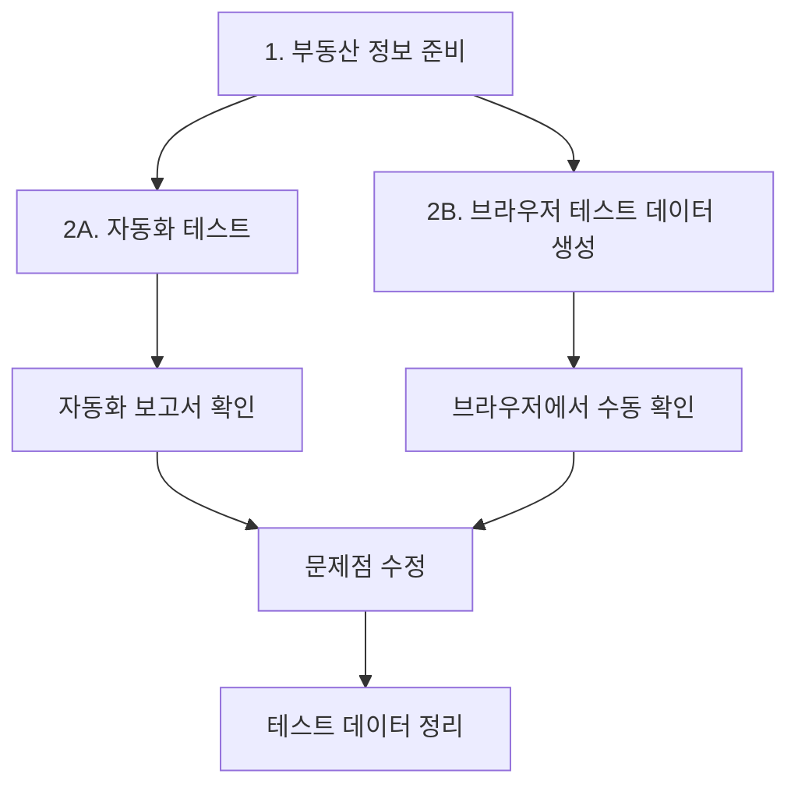

# 부동산 정보 페이지 테스트 가이드

> **작성일**: 2025-07-22  
> **버전**: 1.0  
> **대상**: XAI 아파트 커뮤니티 부동산 정보 시스템

## 📋 목차

1. [개요](#개요)
2. [테스트 시스템 구조](#테스트-시스템-구조)
3. [자동화 API 테스트](#자동화-api-테스트)
4. [브라우저 확인 테스트](#브라우저-확인-테스트)
5. [테스트 데이터 관리](#테스트-데이터-관리)
6. [문제 해결 가이드](#문제-해결-가이드)
7. [FAQ](#faq)

---

## 개요

부동산 정보 페이지 테스트 시스템은 XAI 아파트 커뮤니티의 부동산 정보 기능을 종합적으로 검증하기 위한 도구입니다.

### 🎯 테스트 범위

- **부동산 정보 조회**: 목록, 상세, 필터링, 검색, 정렬
- **사용자 상호작용**: 댓글/답글 작성, 수정, 삭제
- **반응 시스템**: 좋아요, 싫어요, 북마크 (게시글/댓글)
- **실시간 통계**: 조회수, 반응 수, 댓글 수 업데이트

### 🚫 테스트 제외 사항

- **부동산 정보 게시글 작성/수정/삭제** (관리자 전용)
- **파일 업로드** (부동산 정보에서 사용 안함)
- **관리자 권한** (일반 사용자 기능만 테스트)

---

## 테스트 시스템 구조

### 📁 파일 구조

```
scripts/development/testing/
├── api/                                    # 자동화 API 테스트
│   ├── property_info_api_automation_test.py   # 메인 자동화 테스트
│   ├── property_info_test_report_template.html # HTML 보고서 템플릿
│   ├── test_report_generator.py               # 보고서 생성기 (공용)
│   └── reports/                               # 생성된 보고서들
├── browser/                                # 브라우저 확인 테스트
│   ├── property_info_browser_test_setup.py    # 브라우저 테스트 데이터 생성
│   ├── property_info_browser_test_guide.html  # 브라우저 확인 가이드
│   └── property_info_test_data_manager.py     # 테스트 데이터 관리
└── PROPERTY_INFO_TEST_GUIDE.md            # 이 문서
```

### 🔄 테스트 워크플로우



---

## 자동화 API 테스트

### 🚀 실행 방법

```bash
# 1. 백엔드 서버 실행 확인
curl http://localhost:8000/health

# 2. 부동산 정보 데이터 확인 (최소 5개 권장)
curl "http://localhost:8000/api/posts/?metadata_type=property_information&page_size=10"

# 3. 자동화 테스트 실행
cd scripts/development/testing/api
python property_info_api_automation_test.py
```

### 📊 테스트 섹션

| 섹션 | 설명 | API 강도 | 예상 시간 |
|------|------|----------|-----------|
| 기본 인프라 검증 | 서버 상태, 인증 시스템 | Low | 30초 |
| 부동산 정보 목록 기능 | 목록, 필터링, 검색, 정렬 | Medium | 2분 |
| 부동산 정보 상세 조회 | 상세 조회, 메타데이터 검증 | Medium | 1분 30초 |
| 댓글/답글 시스템 | 댓글 CRUD, 답글, 권한 | High | 3분 |
| 반응 시스템 | 좋아요, 싫어요, 북마크 | Medium | 2분 |
| 실시간 통계 검증 | 목록↔상세 일치성 | Medium | 2분 |
| 데이터 정리 | 테스트 데이터 자동 정리 | Low | 30초 |

### 📈 보고서 확인

테스트 완료 후 생성되는 파일들:
- `reports/property_info_test_report_[TIMESTAMP]_[ID].html` - 시각적 보고서
- `reports/property_info_test_report_[TIMESTAMP]_[ID].json` - 상세 데이터

**HTML 보고서 열기:**
```bash
# 브라우저에서 직접 열기
open reports/property_info_test_report_[최신파일].html
# 또는
python -m http.server 8080
# http://localhost:8080/reports/ 에서 확인
```

---

## 브라우저 확인 테스트

### 🌐 브라우저 테스트 설정

```bash
# 1. 프론트엔드 서버 실행 확인
curl http://localhost:5173

# 2. 브라우저 테스트 데이터 생성
cd scripts/development/testing/browser
python property_info_browser_test_setup.py

# 3. 브라우저 확인 가이드 열기
open property_info_browser_test_guide.html
```

### 👤 테스트 사용자 계정

브라우저 테스트용 계정들이 자동 생성됩니다:

```
사용자 1:
- 이메일: propbrowser_[ID]@example.com  
- 비밀번호: browsertest123

사용자 2:
- 이메일: propuser2_[ID]@example.com
- 비밀번호: browsertest123
```

### ✅ 브라우저 테스트 체크리스트

#### 기본 기능
- [ ] 정보 목록 페이지가 정상적으로 로딩됨
- [ ] 부동산 정보 카테고리 필터링이 작동함
- [ ] 검색 기능이 정상 작동함
- [ ] 페이지네이션이 정상 작동함
- [ ] 정렬 기능이 정상 작동함

#### 사용자 상호작용
- [ ] 상세 페이지가 정상적으로 표시됨
- [ ] 조회수가 실시간으로 증가함
- [ ] 로그인 후 댓글 작성이 가능함
- [ ] 답글 작성이 가능함
- [ ] 댓글 수정/삭제가 가능함 (본인 댓글만)

#### 고급 기능
- [ ] 좋아요/싫어요 기능이 작동함
- [ ] 북마크 기능이 작동함
- [ ] 댓글 좋아요 기능이 작동함
- [ ] 반응 수가 실시간으로 업데이트됨
- [ ] 목록↔상세 페이지 통계가 일치함

### 🔗 주요 테스트 페이지

- **정보 목록**: http://localhost:5173/info
- **로그인**: http://localhost:5173/auth/login  
- **메인 페이지**: http://localhost:5173
- **API 문서**: http://localhost:8000/docs

---

## 테스트 데이터 관리

### 🧹 테스트 완료 후 정리

**자동 정리 (권장):**
```bash
cd scripts/development/testing/browser

# 특정 세션 정리
python property_info_test_data_manager.py cleanup --session-id [SESSION_ID]

# 7일 이상 된 데이터 정리
python property_info_test_data_manager.py cleanup --days-old 7

# 드라이런 (실제 삭제 없이 확인만)
python property_info_test_data_manager.py cleanup --session-id [SESSION_ID] --dry-run
```

**수동 정리:**
- 관리자 페이지에서 댓글 일괄 삭제
- 테스트 사용자 계정 삭제
- 반응 데이터 초기화

### 📋 데이터 관리 명령어

```bash
# 활성 테스트 세션 목록
python property_info_test_data_manager.py list

# 특정 세션 백업
python property_info_test_data_manager.py backup --session-id [SESSION_ID]

# 모든 테스트 데이터 백업
python property_info_test_data_manager.py backup

# 백업에서 복원 (향후 구현)
python property_info_test_data_manager.py restore --session-id [SESSION_ID]
```

### 📊 정리 보고서

정리 작업 완료 후 생성되는 보고서:
- `cleanup_report_[TIMESTAMP].json` - 정리 작업 상세 결과

---

## 문제 해결 가이드

### 🔧 일반적인 문제들

#### 1. 서버 연결 오류
```bash
# 백엔드 서버 상태 확인
curl http://localhost:8000/health

# 프론트엔드 서버 상태 확인  
curl http://localhost:5173
```

**해결 방법:**
- 서버가 실행 중인지 확인
- 포트 충돌 확인
- 방화벽 설정 확인

#### 2. 부동산 정보 부족
```
⚠️ 부동산 정보가 부족합니다. 추가 생성을 권장합니다.
권장: scripts/development/data-gen/create_property_info_posts.py 실행
```

**해결 방법:**
```bash
cd scripts/development/data-gen
python create_property_info_posts.py
```

#### 3. 인증 관련 오류
```
❌ 관리자 로그인 실패: 401 - Unauthorized
```

**해결 방법:**
- 관리자 계정 생성 확인
- 비밀번호 정확성 확인
- JWT 토큰 만료 시 재로그인

#### 4. Rate Limiting 오류
```
⚠️ Rate limit 감지 - 대기 시간을 12.0초로 증가
```

**해결 방법:**
- 자동으로 대기 시간이 조절됨
- 강제 중단 후 잠시 대기 후 재실행

### 🔍 로그 확인 방법

**자동화 테스트 로그:**
- 콘솔 출력에서 실시간 확인
- JSON 보고서의 `error` 필드 확인

**브라우저 테스트 로그:**
- 브라우저 개발자 도구 Console 탭
- Network 탭에서 API 요청/응답 확인

**백엔드 로그:**
```bash
# FastAPI 서버 실행 시 콘솔 출력 확인
cd backend
uv run python main.py
```

---

## FAQ

### Q1: 자동화 테스트와 브라우저 테스트의 차이점은?

**자동화 테스트:**
- API 레벨에서 백엔드 기능을 직접 검증
- 빠르고 정확한 결과
- CI/CD 파이프라인에 적합

**브라우저 테스트:**
- 실제 사용자 관점에서 UI/UX 검증
- 프론트엔드와 백엔드 통합 확인
- 수동 확인이지만 사용자 경험 중심

### Q2: 테스트 데이터가 실제 서비스에 영향을 주나요?

아니요. 테스트 데이터는:
- 명확한 패턴으로 식별 가능 (세션 ID 포함)
- 자동 정리 시스템으로 안전하게 제거
- 부동산 정보 게시글은 수정하지 않음 (기존 데이터 활용)

### Q3: 테스트 실행 전 필요한 준비사항은?

1. **백엔드 서버 실행** (http://localhost:8000)
2. **프론트엔드 서버 실행** (http://localhost:5173)  
3. **부동산 정보 데이터 최소 5개** (create_property_info_posts.py로 생성)
4. **관리자 계정 존재** (admin@example.com / admin123)

### Q4: 테스트가 실패하면 어떻게 해야 하나요?

1. **오류 메시지 확인**: 콘솔 출력이나 보고서에서 구체적인 오류 확인
2. **환경 점검**: 서버 상태, 네트워크 연결, 데이터 존재 여부
3. **개별 기능 테스트**: 문제가 된 API를 직접 호출해보기
4. **로그 분석**: 백엔드 서버 로그에서 상세 오류 확인

### Q5: 테스트 데이터 정리를 깜빡했어요.

```bash
# 모든 테스트 세션 확인
python property_info_test_data_manager.py list

# 오래된 데이터 일괄 정리 (7일 이상)
python property_info_test_data_manager.py cleanup --days-old 7

# 드라이런으로 먼저 확인
python property_info_test_data_manager.py cleanup --days-old 7 --dry-run
```

### Q6: 새로운 기능 추가 시 테스트는 어떻게 수정하나요?

1. **자동화 테스트**: `property_info_api_automation_test.py`에서 해당 섹션 함수 수정
2. **브라우저 테스트**: `property_info_browser_test_guide.html`의 체크리스트에 항목 추가
3. **보고서 템플릿**: 필요시 `property_info_test_report_template.html` 수정

---

## 📞 지원 및 문의

테스트 관련 문제나 개선사항이 있으면:

1. **로그와 오류 메시지 수집**
2. **재현 단계 정리** 
3. **환경 정보 확인** (OS, 브라우저, 서버 버전 등)
4. **개발팀에 이슈 리포트**

---

**마지막 업데이트**: 2025-07-22  
**문서 버전**: 1.0  
**테스트 시스템 버전**: 1.0